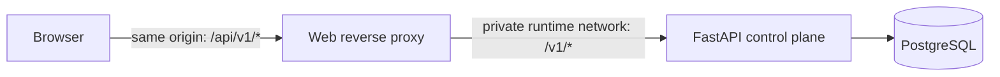

# Same-origin browser–API seam

The browser always calls the relative `/api` base path. The web server proxies that path to the
real control-plane API, so local and demo deployments share one security model and no browser URL
or credential is compiled into the application.

## Quick path

1. Set the existing Compose variables from `.env.example` and run the stack.
2. Open `http://127.0.0.1:${WEB_PORT:-8080}`; browser clients resolve the API base from
   `public/api/runtime-config.js` as `/api`.
3. Create one `createMemoryCredentialStore`, set an API key issued by the existing #13 mechanism,
   and pass the store to `createAdministrativeApiClient`.

```js
import {
  createAdministrativeApiClient,
  createMemoryCredentialStore,
} from "/public/api/client.js";

const credentialStore = createMemoryCredentialStore();
credentialStore.set(keyEnteredForThisBrowserSession);
const controlApi = createAdministrativeApiClient({ credentialStore });
const principals = await controlApi.listPrincipals();
```

The store is closure-backed memory only. Reloading the page clears it. Application code MUST NOT
copy bearer credentials into URLs, cookies, Web Storage, fixtures, telemetry, or logs.

## Topology



| Environment | Browser base | Proxy upstream | Configuration |
|---|---|---|---|
| Local Compose | `/api` | `api:8000` | `API_UPSTREAM` image default |
| Demo | `/api` | deployment-private API address | override `API_UPSTREAM` |
| Consumer test | `/api` | `127.0.0.1:4174` | `BROWSER_API_UPSTREAM` |

`API_UPSTREAM` is expanded by the official Nginx entrypoint from
`docker/nginx.conf.template`. Keep it private; browsers never receive that address. A deployment may
replace `runtime-config.js`, but `apiBaseUrl` deliberately accepts only a same-origin absolute path.

## CORS and CSRF posture

This topology does not enable CORS. The proxy removes upstream CORS response headers and rejects
requests marked `Sec-Fetch-Site: cross-site`. Its Content Security Policy limits `connect-src` to
the same origin.

CSRF does not rely on a token because authentication has no ambient browser credential: the client
uses an explicit in-memory `Authorization: Bearer` header, sends `credentials: "omit"`, and the
proxy removes `Cookie` before forwarding. These controls MUST remain together; enabling cookies or
cross-origin API access requires a new threat-model decision.

## Error contract

`ApiClientError` exposes safe fields only: `kind`, `status`, `code`, `requestId`, and `retryable`.

| Condition | `kind` | Status |
|---|---|---|
| Missing, invalid, expired, or revoked credential | `authentication` | 401 |
| Authenticated but unauthorized principal | `authorization` | 403 |
| Hidden or absent resource | `not_found` | 404 |
| Concurrency or idempotency conflict | `conflict` | 409 |
| Fetch cannot obtain a response | `network` | none |

The adapter never returns an error response as successful data, so callers cannot show a false
confirmation after 409. Other HTTP failures use `api` and retain the server error code when safe.

## Real consumer test

The test is destructive by design and refuses to run unless the test and demo database identities
differ. It migrates and seeds the isolated database, runs the real eight-route FastAPI control
plane, and reaches it from Chromium through the same-origin proxy. It has no fixture fallback.

```sh
BROWSER_API_TEST_DATABASE_URL=postgresql://user@127.0.0.1:55432/browser_api_test \
DEMO_DATABASE_URL=postgresql://user@127.0.0.1:5432/sre_agent \
npm run test:browser-api
```

The runner generates disposable credentials without printing them. Traces and screenshots are off
for this suite so bearer values are not persisted as test artifacts. The assertions cover valid,
missing, invalid, and revoked authentication; 403 without mutation; 404; 409 without false state;
cross-site rejection; absent CORS allowance; network failure; and empty Web Storage.
