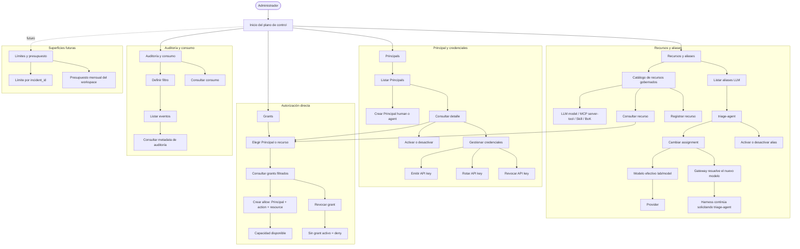

# HT-CTRL-01 — Mapa de usuario del plano de control

- Issue: #56
- Versión del artefacto: 1.0
- Estado: propuesta revisable para derivar wireframes de #57
- Alcance: MVP single-workspace
- Contrato rector: #9 y `schemas/releases/1.0.0/openapi/control-plane.yaml`

## Objetivo

Describir cómo un administrador recorre el plano de control para configurar y gobernar capacidades sin introducir organizaciones, roles o SSO. El mapa separa identidad (`Principal`), autenticación (credenciales), autorización (grants directos) y selección de modelo (alias lógico).

Reglas que el diseño no debe reinterpretar:

1. `Principal` representa identidad humana o agéntica (`human | agent`).
2. `triage-agent` es un alias/modelo lógico administrado, no un `Principal`.
3. Un grant es `Principal + action + resource`; su efecto en el MVP es `allow`.
4. Ausencia de grant activo implica `deny`.
5. Cambiar la asignación de `triage-agent` cambia el comportamiento gobernado en el gateway sin modificar el harness.
6. No existen organizaciones, roles ni SSO como requisitos del MVP.

## Mapa de usuario

## Navegación y vistas derivables

La navegación de primer nivel propuesta es estable y deliberadamente pequeña:

| Vista | Objetivo administrativo | Subvistas / acciones |
| --- | --- | --- |
| Inicio | Entrar al plano de control single-workspace | Accesos a Principals, Recursos y aliases, Grants, Auditoría y consumo; bloque futuro de límites |
| Principals | Administrar identidades humanas y agénticas | Listado, alta, detalle, activar/desactivar |
| Detalle de Principal | Gobernar una identidad concreta | Estado, credenciales, grants del Principal, acceso a auditoría filtrada |
| Credenciales | Gestionar API keys de un Principal | Emitir, rotar, revocar; nunca volver a mostrar el secreto después de la emisión inicial |
| Recursos | Explorar recursos gobernables | LLM model, MCP server/tool, Skill, BoK; detalle y registro cuando exista contrato CRUD |
| Aliases LLM | Administrar nombres lógicos estables | Listado, detalle, `triage-agent`, assignment, activar/desactivar |
| Grants | Administrar autorización directa | Seleccionar primero Principal o recurso, listar filtrado, crear allow, revocar |
| Auditoría | Revisar decisiones y ejecuciones | Seleccionar filtro, listado, detalle metadata-only |
| Consumo | Revisar uso agregado | Tokens, latencia, costo estimado y estado cuando exista contrato de consumo |
| Límites y presupuesto | Reserva de superficie futura | Límite por sesión `incident_id` y presupuesto mensual del workspace |

### Navegación contextual

Además de la navegación principal, los wireframes de #57 deberían permitir:

- `Principal detail -> Credentials`.
- `Principal detail -> Grants` con `principal_id` preseleccionado.
- `Resource detail -> Grants` con `resource_id` preseleccionado.
- `Principal detail -> Audit` con el Principal preseleccionado.
- `Model alias detail -> Audit` con el alias preseleccionado.

Esto evita presentar Grants y Auditoría como listados globales que el contrato actual no permite consultar sin filtros.

## Recorridos prioritarios

### 1. Preparar un Principal

1. Abrir **Principals**.
2. Crear `Principal` con `principal_id`, `kind = human | agent` y `display_name`.
3. Abrir su detalle.
4. Emitir una API key.
5. Mostrar el secreto una sola vez y obligar al administrador a copiarlo/confirmarlo antes de cerrar el resultado.
6. Desde el mismo detalle, continuar a Grants para otorgar capacidades.

### 2. Cambiar el modelo detrás de `triage-agent`

1. Abrir **Recursos y aliases -> Aliases LLM**.
2. Abrir `triage-agent`.
3. Reemplazar su assignment por otro `<lab>/<modelo>` y provider según el contrato finalmente acordado.
4. Guardar.
5. El gateway utiliza la nueva resolución; el harness continúa enviando `model = triage-agent`.

No debe existir una acción del tipo “editar harness” en este recorrido.

### 3. Otorgar acceso

1. Entrar a Grants desde un Principal o un recurso.
2. Revisar los grants existentes con el filtro contextual ya seleccionado.
3. Crear `allow` especificando exactamente:
   - `principal_id`;
   - `action`;
   - `resource.resource_type`;
   - `resource.resource_id`.
4. Reflejar que la capacidad queda disponible sin crear roles u organizaciones.

### 4. Revocar acceso

1. Abrir los grants del Principal/recurso.
2. Revocar el grant seleccionado.
3. Mostrar el estado convergente como revocado.
4. Explicar que, al no existir otro grant aplicable, la decisión efectiva es `deny`.

### 5. Revisar auditoría

1. Abrir Auditoría.
2. Elegir al menos un filtro permitido antes de consultar.
3. Mostrar la lista metadata-only.
4. Abrir el detalle para correlacionar Principal, decisión, alias y ejecución/sesión cuando apliquen.
5. No ofrecer recuperación de contenido crudo desde la pantalla de auditoría.

## Sprint 1 vs preparación de Sprint 2

### Sprint 1 — este issue

- Definir el mapa y navegación.
- Fijar vocabulario UX alineado con contratos.
- Identificar contradicciones o contratos faltantes antes de wireframes.
- Entregar evidencia versionada.

No se implementa frontend en Sprint 1 por este issue.

### Sprint 2 — superficies que este mapa prepara

- Administración de Principals y credenciales (#19, que debe refinar su redacción histórica de usuarios/roles).
- Recursos y aliases (#20).
- Grants y futura separación de límites/cuotas (#21).
- Auditoría/consumo (#25).
- Wireframes de #57 como contrato visual previo a implementación.

### Posterior / contrato todavía abierto

- Registro CRUD del catálogo genérico de recursos cuando se defina el endpoint correspondiente.
- Gobierno ejecutable de MCP, Skills y BoK según sus historias posteriores.
- Límite por sesión de incidente y presupuesto mensual.
- Métricas/endpoint de consumo si no se derivan de otra fuente acordada.

## Decisiones UX que afectan contratos API

Estas decisiones deben resolverse o quedar explícitamente diferidas antes de convertir el mapa en wireframes implementables.

### UX-API-01 — `provider` opcional vs requerido

El issue/épica describen `alias -> <lab>/<modelo> + provider opcional`, pero el contrato 1.0.0 actual de `ModelAliasCreate`, `ModelAliasAssignment` y `ModelAlias` exige `inference_provider`.

Decisión requerida: una de las siguientes debe convertirse en autoridad única.

- A. Provider obligatorio en UI y contrato.
- B. Provider opcional en UI y contrato, permitiendo que el router seleccione el efectivo.

El wireframe no debe fingir opcionalidad mientras la API lo exige.

### UX-API-02 — CRUD del catálogo de recursos

`resource.schema.json` define tipos gobernados (`llm_model`, `mcp_server`, `mcp_tool`, `skill`, `bok_collection`), pero `control-plane.yaml` 1.0.0 no publica endpoints CRUD genéricos de Resource.

Decisión requerida: definir si en Sprint 2 el catálogo:

- obtiene recursos de fuentes específicas y solo los consulta;
- introduce endpoints de Resource; o
- difiere registro/edición y muestra únicamente recursos ya materializados.

### UX-API-03 — Grants no tienen listado global sin contexto

`GET /v1/grants` requiere `principal_id` o `resource_id`.

Decisión UX: la pantalla Grants debe exigir uno de esos filtros antes de consultar. La navegación contextual desde Principal/Resource es el camino preferente.

No diseñar una tabla global cargada automáticamente si el contrato permanece igual.

### UX-API-04 — Auditoría exige filtro inicial

`GET /v1/audit-events` requiere al menos un filtro entre Principal, decisión, alias, request/correlación o rango temporal.

Decisión UX: Auditoría abre en un estado de selección de filtros, no como un listado global automático.

### UX-API-05 — Auditoría es metadata-only

El contrato de control declara que la consulta administrativa de auditoría no recupera contenido raw/redacted.

Decisión UX: el detalle de auditoría debe diseñarse alrededor de metadata y correlación. No incluir un visor de prompt/respuesta salvo que otro contrato explícito lo habilite en el futuro.

### UX-API-06 — Consumo no tiene contrato dedicado en 1.0.0

#25 espera latencia, tokens, costo estimado y estado; el `control-plane.yaml` actual solo publica Principals, Credentials, ModelAliases, Grants y Audit.

Decisión requerida: definir la fuente y el contrato de consumo antes de implementar esa vista. Puede ser endpoint dedicado, proyección agregada u otra fuente, pero no debe inferirse desde el wireframe.

### UX-API-07 — Secreto de credencial de una sola visualización

La API de emisión/rotación revela la key únicamente en el primer éxito; un replay no vuelve a revelar el secreto.

Decisión UX: emisión y rotación requieren un estado de resultado específico de “copiar ahora”; después solo se muestra metadata de la credencial.

### UX-API-08 — Desactivar Principal no debe asumir cascadas inexistentes

El contrato expone reemplazo de `Principal.status`, revocación de credenciales y revocación de grants como operaciones separadas.

Decisión requerida: el frontend no debe asumir que desactivar un Principal revoca automáticamente credenciales o grants salvo que el backend formalice esa semántica. Si se desea una acción compuesta, debe definirse explícitamente.

### UX-API-09 — Listas acotadas sin paginación

Las listas del contrato 1.0.0 usan `limit <= 100`, `truncated` y no permiten cursor/page/offset.

Decisión UX: no dibujar paginación tradicional. Cuando `truncated = true`, la interfaz debe pedir acotar mediante filtros cuando existan o tratar el límite de 100 como restricción explícita del MVP. Si se requiere navegación de más resultados, implica cambio de contrato.

### UX-API-10 — Modelo/provider efectivo en Auditoría

#57 requiere distinguir alias lógico de modelo/provider efectivo. Antes de implementación debe verificarse que la proyección administrativa de auditoría exponga esos valores de forma mostrable y con la política de redacción adecuada.

El wireframe puede reservar las columnas, pero no debe inventar campos ni filtros no presentes en el contrato.

## Estados que #57 debe contemplar

- Principals vacío.
- Principal inactivo.
- Principal sin credenciales.
- Emisión de API key con secreto visible una sola vez.
- Resource catalog vacío/no disponible si su contrato aún no existe.
- Alias inactivo.
- Grant list sin resultados para el filtro elegido.
- Operación denegada por ausencia de grant.
- Auditoría sin filtro seleccionado.
- Auditoría sin resultados.
- Error `401` por credencial inválida/revocada.
- Error `403` por falta de autorización.
- Error `503 audit_unavailable` cuando la auditoría autoritativa no puede aceptar el evento.

## Trazabilidad con criterios de aceptación de #56

| Criterio | Evidencia en este artefacto |
| --- | --- |
| Principals, credenciales, recursos y grants sin organizaciones/roles | Reglas rectoras, mapa y recorridos 1/3/4 |
| `triage-agent` es alias, no identidad | Reglas 2 y recorrido 2 |
| Configuración, asignación/revocación y auditoría | Recorridos 2–5 |
| Sprint 1 vs preparación Sprint 2 | Sección de alcance por sprint |
| Derivable a wireframes sin reinterpretar autorización | Navegación contextual + UX-API-03 + semántica direct-grant/default-deny |
| Cambiar alias no modifica harness | Recorrido 2 y mapa `assignment -> gateway -> harness` |
| No se requieren rol/organización para acceso | Reglas 3/4/6 y recorrido 3 |

## Evidencia y versionado

Este archivo es la evidencia versionada base de HT-CTRL-01. Si se genera posteriormente una versión FigJam/Figma, debe enlazarse aquí y conservar este documento como fuente textual de decisiones y trazabilidad.

Cambios de semántica que afecten los contratos deben actualizar primero la autoridad correspondiente (#9 / schemas / ADR) y después este mapa; el wireframe de #57 no debe convertirse en una fuente normativa alternativa.
