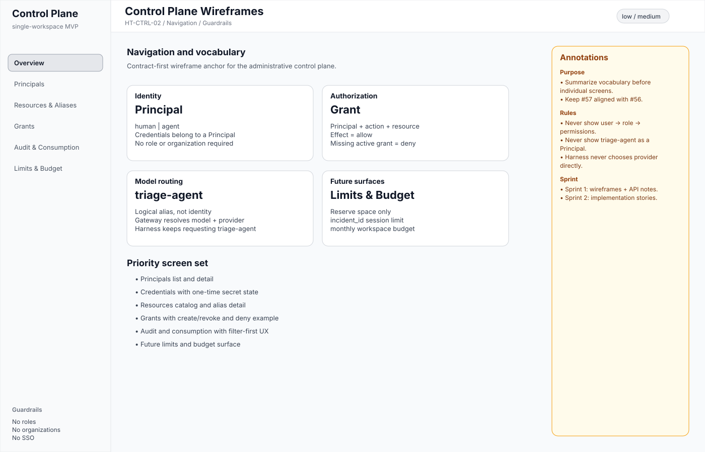
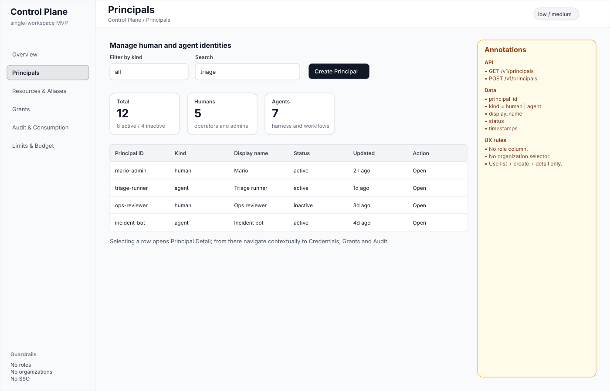
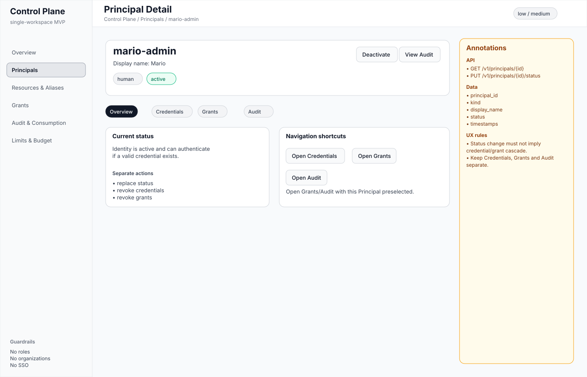
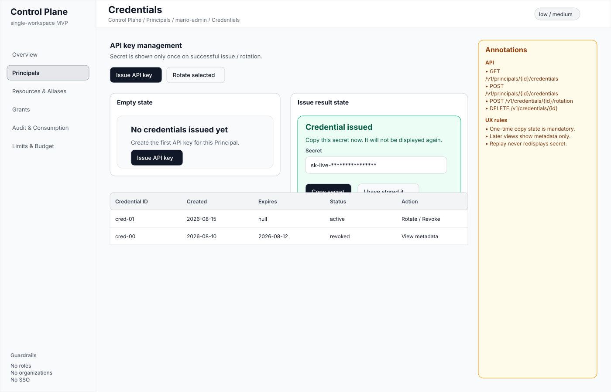
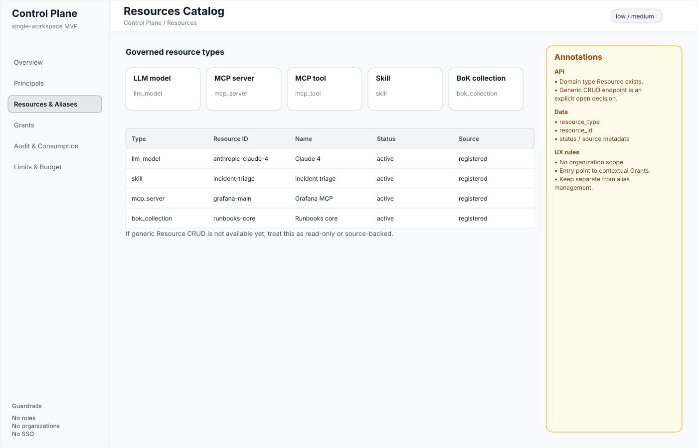
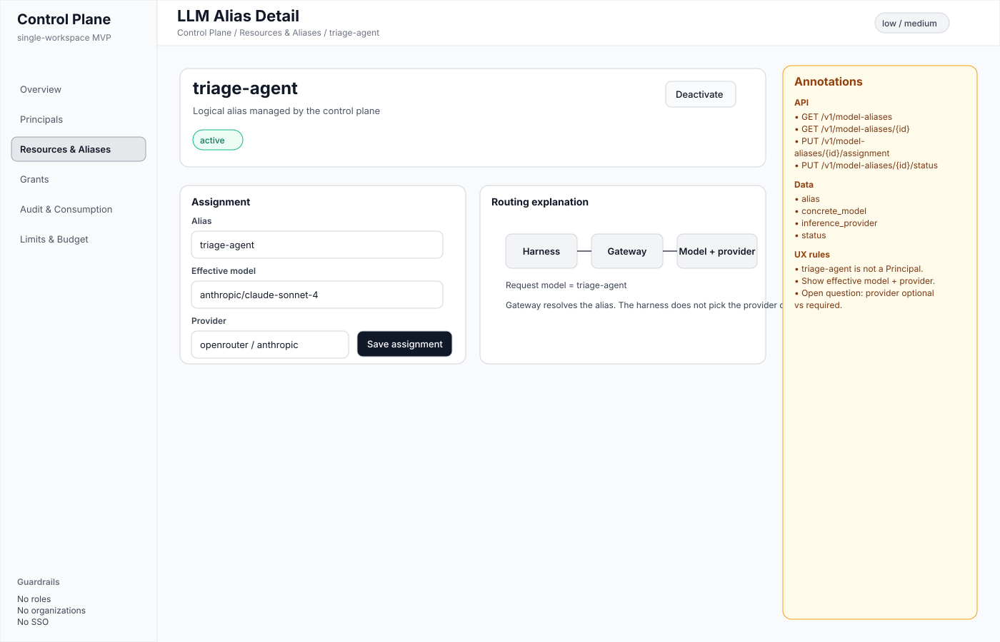

# HT-CTRL-02 — Wireframes del plano de control

- Issue: #57
- Versión del artefacto: 1.0
- Estado: propuesta revisable para refinamiento de historias administrativas de Sprint 2
- Alcance: MVP single-workspace
- Derivado de: #56
- Contrato rector: #9 y `schemas/releases/1.0.0/openapi/control-plane.yaml`

## Objetivo

Definir un conjunto pequeño de wireframes de baja/media fidelidad para el plano de control administrativo, alineados con el modelo vigente:

- `Principal = human | agent`;
- credenciales asociadas a un `Principal`;
- recursos gobernados;
- aliases LLM administrados;
- grants directos;
- auditoría y consumo;
- reserva de superficie futura para límites por sesión y presupuesto mensual.

Los wireframes no introducen organizaciones, roles, SSO ni multi-tenancy como requisitos del MVP.

---

## Navegación principal

La navegación propuesta del plano de control es:

1. Overview
2. Principals
3. Resources & Aliases
4. Grants
5. Audit & Consumption
6. Limits & Budget

La navegación contextual permite además:

- `Principal Detail -> Credentials`
- `Principal Detail -> Grants`
- `Principal Detail -> Audit`
- `Resource -> Grants`
- `Alias -> Audit`

---

# Wireframes

## 00 — Overview

Vista de referencia que fija el vocabulario y las restricciones del plano de control.



Reglas visibles:

- `Principal` representa identidad humana o agéntica.
- `Grant = Principal + action + resource`.
- `triage-agent` es un alias lógico, no una identidad.
- el harness solicita `triage-agent`;
- el gateway resuelve el modelo/provider efectivo;
- no existen roles, organizaciones o SSO como requisitos del MVP.

---

## 01 — Principals List

Listado administrativo de Principals humanos y agénticos.



### Datos principales

- `principal_id`
- `kind = human | agent`
- `display_name`
- `status`
- timestamps

### API

- `GET /v1/principals`
- `POST /v1/principals`

---

## 02 — Principal Detail

Detalle de una identidad concreta.



Desde esta vista se accede contextualmente a:

- Credentials
- Grants
- Audit

### API

- `GET /v1/principals/{id}`
- `PUT /v1/principals/{id}/status`

### Decisión UX

Desactivar un Principal no debe interpretarse automáticamente como revocación de credenciales y grants, ya que actualmente son operaciones separadas.

---

## 03 — Credentials

Gestión de API keys asociadas a un Principal.



Incluye:

- listado de credenciales;
- emisión;
- rotación;
- revocación;
- estado vacío;
- visualización del secreto únicamente durante la emisión inicial.

### API

- `GET /v1/principals/{id}/credentials`
- `POST /v1/principals/{id}/credentials`
- `POST /v1/credentials/{id}/rotation`
- `DELETE /v1/credentials/{id}`

### Estado vacío

Se representa explícitamente el caso:

> No credentials issued yet.

### Regla UX

El secreto debe mostrarse una sola vez. Las consultas posteriores presentan únicamente metadata.

---

## 04 — Resources Catalog

Catálogo de recursos gobernados por el plano de control.



Tipos representados:

- `llm_model`
- `mcp_server`
- `mcp_tool`
- `skill`
- `bok_collection`

### Decisión pendiente

El dominio define `Resource`, pero el contrato actual no expone todavía un CRUD genérico de recursos.

Por tanto, esta vista puede implementarse inicialmente como:

- catálogo read-only;
- vista alimentada desde otras fuentes;
- o superficie reservada hasta definir el contrato correspondiente.

---

## 05 — Alias Detail

Configuración del alias lógico `triage-agent`.



La pantalla distingue:

- alias lógico;
- modelo efectivo;
- provider;
- status.

### API

- `GET /v1/model-aliases`
- `GET /v1/model-aliases/{id}`
- `PUT /v1/model-aliases/{id}/assignment`
- `PUT /v1/model-aliases/{id}/status`

### Regla principal

`triage-agent` no representa una identidad.

El flujo conceptual es:

```text
Harness
   |
   | model = triage-agent
   v
Gateway
   |
   v
Modelo efectivo + provider