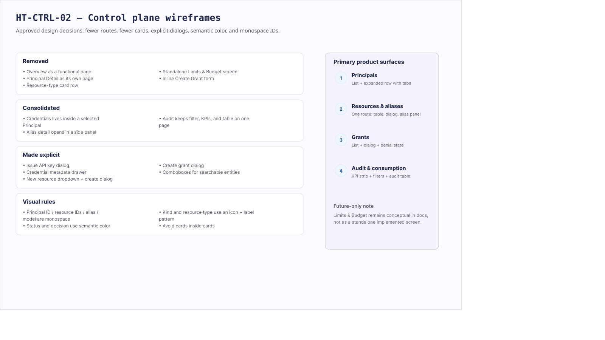
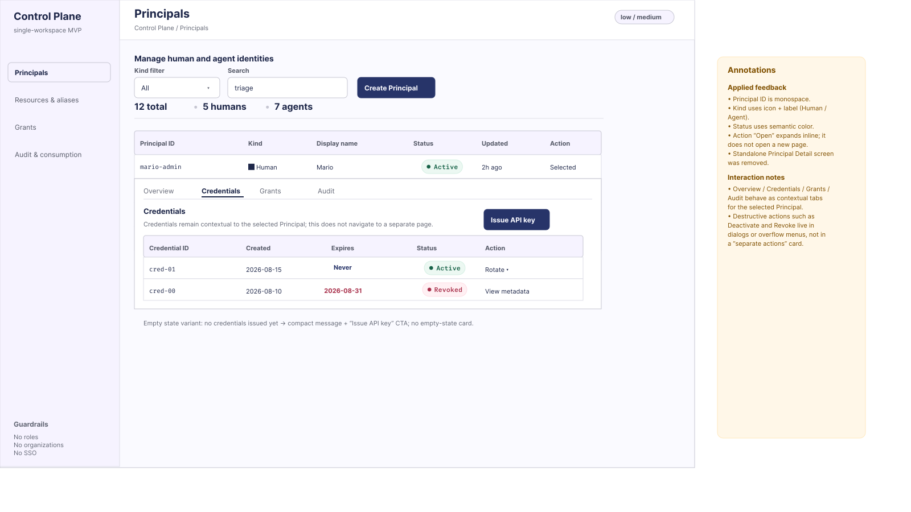
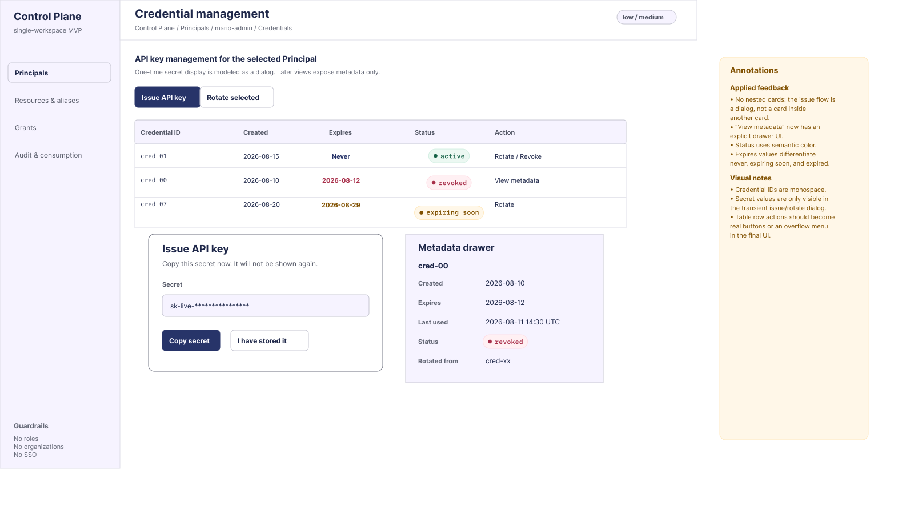
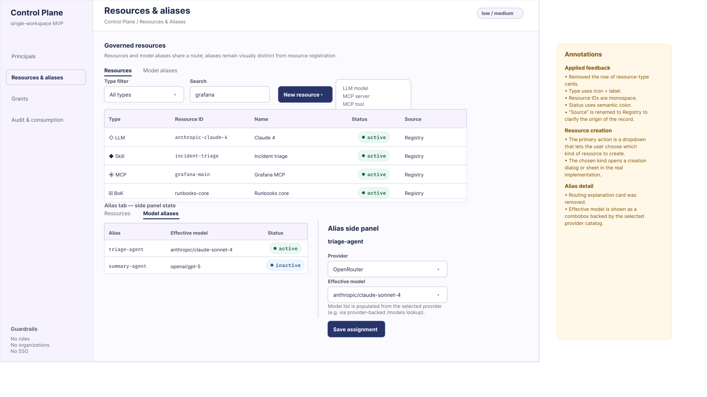
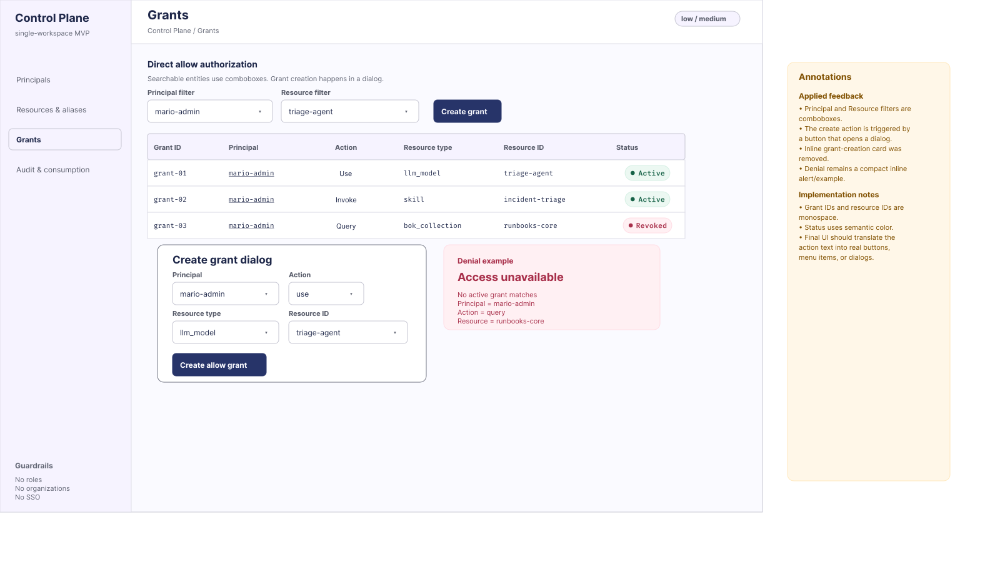
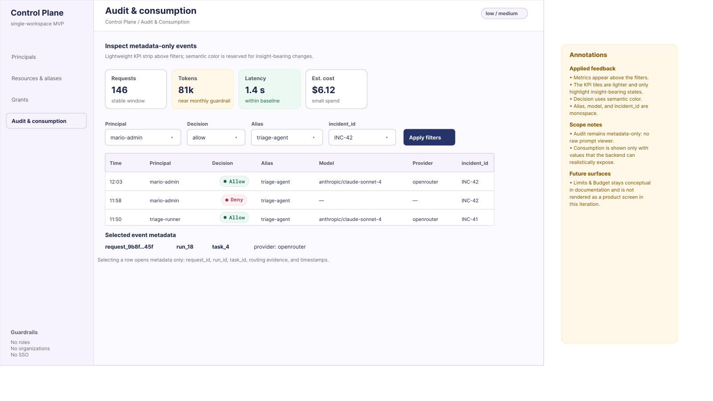
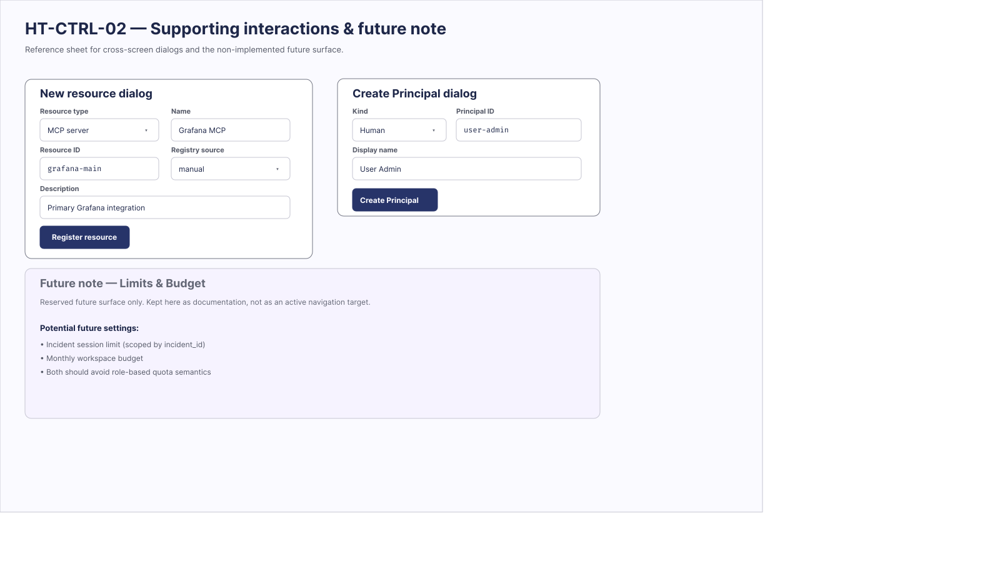

# HT-CTRL-02 — Wireframes aprobados del plano de control

- Issue: #57
- Estado: artefacto canónico aprobado
- Alcance: MVP single-workspace
- Derivado de: #56
- Contrato rector: #9 y `schemas/releases/1.0.0/openapi/control-plane.yaml`

## Objetivo

Definir los wireframes aprobados de baja/media fidelidad para el plano de control administrativo, sin introducir organizaciones, roles, SSO ni multi-tenancy como requisitos del MVP.

El diseño aprobado prioriza tablas, detalles contextuales, diálogos, drawers, comboboxes y color semántico. Consolida las decisiones de navegación y composición necesarias para evitar fragmentación de pantallas y uso innecesario de cards.

Los siete SVG siguen los tokens semánticos de tema claro de MA. Los 19 indicadores de estado, ciclo de vida y decisión de política usan la anatomía canónica de `.ma-badge`: píldora de 24 px, punto de 6.72 px, separación de 6 px, padding horizontal de 8.8 px y etiqueta monoespaciada vectorizada. Los tonos son semánticos por contexto (`success`, `warning`, `critical`, `info`, `allow` y `deny`).

El artefacto se validó mediante XML, renders a 1600×900, inventario de color/tipografía y una comprobación de ausencia de solapamientos de badges o elementos de primer plano.

## Arquitectura de información

Las superficies principales del producto quedan reducidas a cuatro:

1. **Principals**
   - listado de Principals;
   - detalle contextual mediante fila expandida;
   - tabs `Overview`, `Credentials`, `Grants` y `Audit`;
   - no existe una página `Principal Detail` independiente.

2. **Resources & aliases**
   - catálogo de recursos;
   - aliases LLM administrados en la misma ruta;
   - creación de recursos mediante dropdown + dialog;
   - detalle de alias mediante side panel.

3. **Grants**
   - filtros por Principal y Resource mediante comboboxes;
   - tabla de grants;
   - creación mediante dialog;
   - estado de denegación explícito.

4. **Audit & consumption**
   - KPIs relevantes;
   - filtros;
   - tabla de eventos;
   - metadata contextual del evento seleccionado.

`Limits & Budget` permanece como superficie futura/documental y no se representa como una ruta funcional de Sprint 1.

---

# Wireframes

## 00 — Resumen de decisiones

Resumen de las decisiones de diseño incorporadas en el artefacto aprobado.



### Decisiones principales

Se eliminan:

- `Overview` como pantalla funcional;
- `Principal Detail` como página independiente;
- el row de cards para tipos de recursos;
- `Limits & Budget` como pantalla independiente;
- el formulario inline de creación de grants.

Se consolidan:

- credenciales dentro del contexto del Principal;
- alias detail en side panel;
- auditoría, consumo, filtros y tabla en una sola superficie.

Se hacen explícitos:

- dialog de emisión de API key;
- drawer de metadata de credencial;
- dropdown + dialog para creación de recursos;
- dialog de creación de grants;
- comboboxes para entidades buscables.

---

## 01 — Principals

Listado administrativo de Principals humanos y agénticos.



### Comportamiento

Al seleccionar una fila, el detalle se expande en la propia tabla. La fila expandida permite navegar contextualmente entre `Overview`, `Credentials`, `Grants` y `Audit`; no se abre una nueva página para `Principal Detail`.

### Datos

- `principal_id`
- `kind = human | agent`
- `display_name`
- `status`
- timestamps

### Reglas visuales

- `principal_id` debe representarse en monospace;
- `kind` usa patrón `[icono] Human` / `[icono] Agent`;
- `status` usa color semántico;
- acciones destructivas como `Deactivate` o `Revoke` deben resolverse mediante dialogs u overflow menus.

### API

- `GET /v1/principals`
- `POST /v1/principals`
- `GET /v1/principals/{id}`
- `PUT /v1/principals/{id}/status`

---

## 02 — Credential management

Gestión de API keys para el Principal seleccionado.



### Acciones

- emitir API key;
- rotar credencial;
- revocar credencial;
- consultar metadata.

### Emisión de API key

La emisión se representa mediante un **Dialog**, no mediante una card persistente. El secreto se muestra una única vez:

```text
Issue API key
→ mostrar secreto
→ copiar / confirmar almacenamiento
→ cerrar
```

Las vistas posteriores muestran únicamente metadata.

### View metadata

La acción `View metadata` abre un **drawer** que muestra `credential_id`, fecha de creación, fecha de expiración, última utilización, status y la credencial de origen en caso de rotación.

### Estados de expiración y status

La columna `Expires` diferencia visualmente `never` / `never expires` (azul), `expiring soon` (amarillo/ámbar) y `expired` (rojo). El estado de la credencial usa color semántico: `active` (verde), `revoked` (rojo) y estados preventivos (amarillo/ámbar) cuando corresponda.

### API

- `GET /v1/principals/{id}/credentials`
- `POST /v1/principals/{id}/credentials`
- `POST /v1/credentials/{id}/rotation`
- `DELETE /v1/credentials/{id}`

---

## 03 — Resources & aliases

Catálogo de recursos gobernados y configuración de aliases LLM.



### Resources

Los recursos se representan en una tabla. Los tipos considerados son LLM, Skill, MCP y BoK. La columna Type usa `[icono] LLM`, `[icono] Skill`, `[icono] MCP` o `[icono] BoK`; los `resource_id` se muestran en monospace y el status utiliza color semántico. La columna **Registry** representa el origen o registro del recurso.

El botón `New resource` abre un dropdown para elegir `LLM model`, `MCP server`, `MCP tool`, `Skill` o `BoK collection`; luego abre el dialog correspondiente de creación.

### Model aliases

Los aliases comparten la ruta con Resources. El detalle del alias seleccionado se muestra mediante un side panel. `triage-agent` se representa como alias lógico administrado, no como Principal. El formulario distingue alias, provider, effective model y status.

`Effective model` debe ser un **combobox**, no un input de texto libre. El catálogo de modelos depende del provider seleccionado mediante una fuente equivalente a `provider → /models → lista de modelos disponibles`.

### API

- `GET /v1/model-aliases`
- `GET /v1/model-aliases/{id}`
- `PUT /v1/model-aliases/{id}/assignment`
- `PUT /v1/model-aliases/{id}/status`

---

## 04 — Grants

Administración de autorización directa.



La autorización mantiene explícitamente separadas las dimensiones `Principal + Action + Resource`.

### Filtros y creación

Principal y Resource se representan como comboboxes porque son entidades buscables. El botón `Create grant` abre un dialog con Principal, Action, Resource type y Resource ID; no se utiliza un formulario/card inline permanente.

### Estado de denegación

Se incluye un caso de error explícito:

```text
Access unavailable
No active grant matches
Principal = mario-admin
Action = query
Resource = runbooks-core
```

La ausencia de grant aplicable implica `deny`.

### Reglas visuales y API

- `grant_id` y `resource_id` se muestran en monospace;
- status usa color semántico;
- acciones finales deben convertirse en botones, menu items o dialogs reales.

- `GET /v1/grants?principal_id=...`
- `GET /v1/grants?resource_id=...`
- `POST /v1/grants`
- `DELETE /v1/grants/{id}`

---

## 05 — Audit & consumption

Vista administrativa de auditoría y consumo.



### KPI strip y filtros

Los KPIs se muestran sobre los filtros. Solo se utiliza color cuando existe un insight relevante: Requests es neutral, Tokens cercanos al guardrail es amarillo/ámbar, Latency dentro de baseline es verde y costo es neutral salvo que requiera atención.

Los filtros son Principal, Decision, Alias e `incident_id`.

### Tabla y metadata del evento

La tabla distingue Time, Principal, Decision, Alias, Model, Provider e `incident_id`. `Decision` usa color semántico: `allow` (verde) y `deny` (rojo). Alias, model e `incident_id` se muestran en monospace. La vista es `metadata-only`.

Al seleccionar un evento se muestran `request_id`, `run_id`, `task_id`, provider, routing evidence y timestamps. No se muestra contenido raw del prompt/respuesta.

### API

- `GET /v1/audit-events`
- `GET /v1/audit-events/{id}`

---

## 06 — Supporting dialogs & future note

Lámina auxiliar que documenta dialogs reutilizados por las otras superficies.



### New resource dialog

Incluye Resource type, Name, Resource ID, Registry source y Description.

### Create Principal dialog

Incluye Kind, Principal ID y Display name.

### Limits & Budget

`Limits & Budget` queda documentado como superficie futura, no como una ruta activa de Sprint 1. Las configuraciones futuras posibles incluyen límite por sesión de incidente, scoped por `incident_id`, y presupuesto mensual del workspace. No se deben introducir cuotas basadas en roles.

---

# Estados UX incluidos

## Estado vacío

Cuando un Principal no tiene credenciales:

```text
No credentials issued yet
[ Issue API key ]
```

Debe mostrarse como mensaje compacto, sin una card de empty state innecesaria.

## Estado de denegación

En Grants:

```text
Access unavailable
No active grant => deny
```

## Expiración de credenciales

```text
never expires     → azul
expiring soon     → amarillo
expired           → rojo
```

---

# Principios visuales

El artefacto aprobado aplica estas reglas:

1. Evitar cards utilizadas únicamente como relleno.
2. No anidar cards dentro de cards.
3. Preferir tablas para entidades comparables.
4. Preferir whitespace y dividers para separar secciones.
5. Utilizar dialogs y drawers para acciones transitorias.
6. Utilizar side panels para detalles contextuales pequeños.
7. Utilizar color únicamente con significado semántico.
8. Utilizar monospace para identificadores técnicos.
9. Utilizar iconos cuando ayudan a distinguir tipos de entidad.
10. Evitar crear nuevas rutas cuando el detalle puede resolverse inline.

---

# Trazabilidad con criterios de aceptación de #57

| Criterio | Evidencia |
| --- | --- |
| Cubre recorridos de #56 | Principals, Resources & aliases, Grants, Audit & consumption |
| No aparecen roles/organizaciones/SSO | Todas las superficies |
| `triage-agent` se representa como alias lógico | Resources & aliases |
| Muestra modelo efectivo + provider | Alias side panel |
| Grants distingue Principal/action/resource | Grants |
| Audit distingue Principal/alias/model/provider/sesión | Audit & consumption |
| Existe estado vacío | Credentials |
| Existe error/denegación | Grants |
| Existen anotaciones de API/UX | Todas las superficies |
| Sirve para Sprint 2 | Conjunto completo de wireframes |

---

## Archivos del artefacto

```text
docs/design/ht-ctrl-02/
├── 00-review-summary.svg
├── 01-principals-inline.svg
├── 02-credentials-dialogs.svg
├── 03-resources-aliases.svg
├── 04-grants.svg
├── 05-audit-consumption.svg
└── 06-supporting-dialogs-future-note.svg
```
