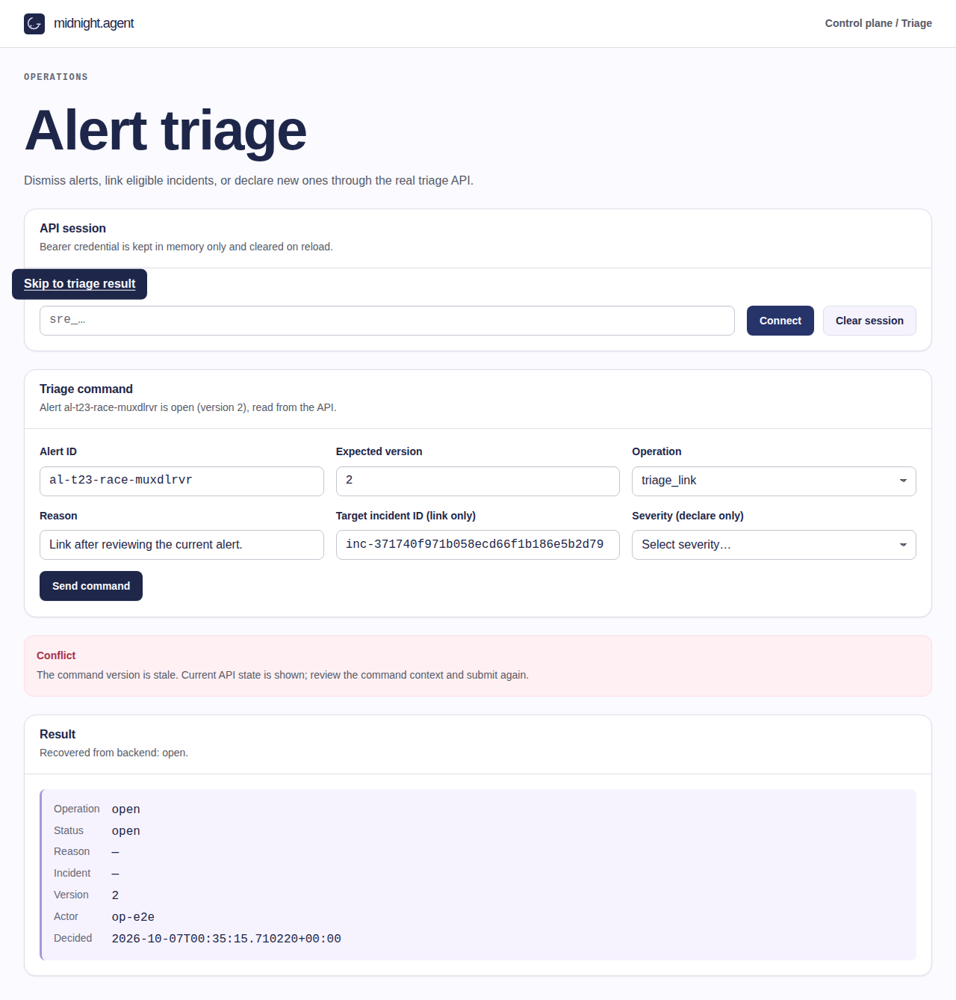
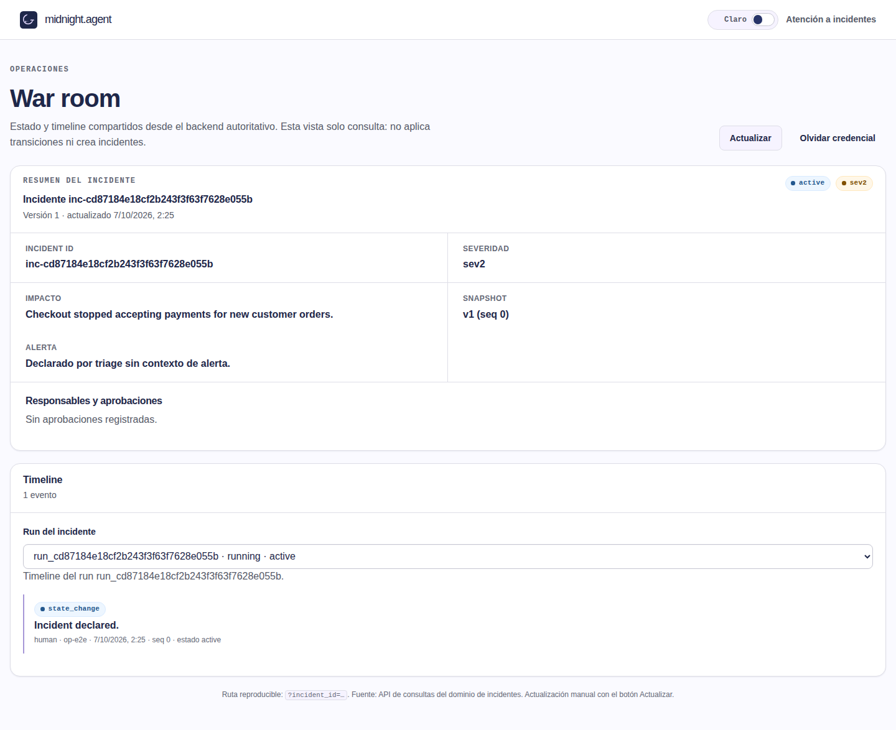
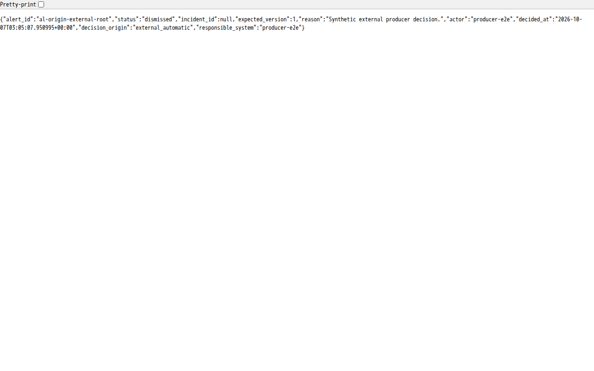

# Issue #23 triage stack review

Status: in progress; **issue #23 is not accepted**. This is a local review, not a published PR, merge authorization or human acceptance. RDD: disabled/unmanaged.

## Scope and identity

Review date: 2026-10-06 (America/Bogota). Authoritative issue: [#23](https://github.com/creep1ng/sre-agent/issues/23), OPEN, Project [midnight.agent #8](https://github.com/users/creep1ng/projects/8), Todo, Estimate 5. Latest user goal targets #23, replacing the initial #330 reference.

Fetched and inspected the exact linear, currently OPEN stack:

| PR | Current head (short display only) |
| --- | --- |
| #373 | 7990109 |
| #374 | a832ad1 |
| #380 | 33992ef |
| #389 | 8dc94a7 |
| #391 | 759fade |
| #392 | e0bb235 |
| #460 | ecad5e3 |
| #463 | 94dff87 |
| #464 | 40f181b |
| #466 | 724b868 |
| #485 | df17a07 |

Stack base: `63ebc6198a0ca5ce257f1826060bb6345d96b095`. Baseline tested head: `df17a07edb8259671763f1ba9e8cfa4e763365bf`. Original checkout: `fe6fca024fec4f89f7538dc5dc03159a99f12a2a`, preserved rather than silently rebasing this divergent stack. Local corrections use `codex/triage-23-stack-review`.

Live hosted checks were successful for all eleven PRs at inspection; this is separate from local behavior proof. The production Playwright config includes `triage.spec.js` but omits the added real recovery/persistence/403/session suites. PR #485 reproduction requires an unavailable `/tmp/seed-c3e.py`, so its commands alone are not repeatable from that commit.

## Baseline observed checks

- Python: **45 passed**, 18.32 seconds: existing store, command, declare, HTTP, contract and UI checks. No new unit tests were added after implementation.
- Browser: **30 passed**, 51.8 seconds, no skips: 17 real nginx/FastAPI/PostgreSQL persistence, recovery, 403 and session-isolation journeys; 13 route-mocked UI checks. Do not describe the latter as real service evidence.
- SQL readback: 13 durable triage rows with synthetic actor and timestamp; five declared incidents with `sev2`/`sev3`, **all five impact values JSON null**, and five rows in `incident.run_events`.
- Real, locally produced session-isolation and 403 screenshots were inspected; credentials were not printed or included in screenshots/traces.
- Initial ad-hoc SQL used the wrong `version` column and nonexistent `incident.events` table; those queries failed and were corrected to `expected_version` and `incident.run_events`. They are not product failures.

## Requirement audit (not acceptance)

| Criterion | Current evidence | Remaining work |
| --- | --- | --- |
| CA1 durable dismiss, actor/time/reload | Real dismiss/recovery journeys and SQL readback pass | Bind final correction candidate and durable reproduction |
| CA2 eligible target list and rejection by ID | Backend sequential rejection exists; no list handler or selection UI | Implement contracted listing; verify link-versus-close race and real selection |
| CA3 declare ID, severity/impact/event/reload | Real declaration/reload and SQL event/ID/severity proof | Impact is explicitly unresolved in contract and null in runtime; product decision required |
| CA4 no duplicate key effects; conflict refresh/context | Existing backend idempotency/CAS checks pass | Authorized GET recovery now passes real browser proof; terminal rewrite is now rejected with identity/replay preserved; full criterion matrix remains pending |
| CA5 403/missing policy/evaluation failure without false success | Real grantless 403 and absent persisted decision pass | Demonstrate missing-policy/evaluation-failure paths; do not invent an evaluator |
| CA6 manual versus external automatic distinction | No browser anomaly/threshold evaluator; actor displayed | No decision-origin projection or external automatic evidence; authoritative contract required |

Two further explicit integration requirements remain unmet: `public/incident-ui/alerts.js` only emits an unconsumed `midnight:triage-requested` event; no inbox→triage navigation exists. The triage UI hardcodes every operation instead of consuming domain-provided permitted actions. The direct-URL browser journeys above do not prove inbox journeys. Alert source metadata is not automatic decision origin.

Additional **P1 confirmed through real HTTP**, corrected below: one synthetic alert received `triage_declare` 201/version1, then `triage_dismiss` 200/version2/incident_id null, then `triage_declare` 201/version3 with a *different* incident ID. The current guard rejects repeated declare only while the status is still declared; another command can erase that guard and canonical association. Captured safe output: `/tmp/triage23-review/terminal-probe.log`. Workflow triage decisions have terminal destinations; the browser must not invent another state machine to cover this service failure.

## Corrected P1: link versus concurrent close

`TriageService._transition` read destination eligibility through a non-locking MVCC SELECT. A closer could commit a closed state while the linker still held an earlier eligible snapshot, then the linker persisted success. This violates CA2's revalidation guarantee. `FOR UPDATE` now holds the incident row through the same transaction as the triage write: a close that wins is observed and rejected with 409; a link that wins completes before the close.

Failure cases were written before production code. Parent independently repeated the final tests with baseline service bytes: **RED 2 failed / 3 passed**, 9.61 seconds. Corrected current candidate: **50 passed**, 14.04 seconds across all existing triage Python suites and the two concurrency cases. Worker targeted GREEN5passed after refactor; Ruff check/format and diff whitespace checks pass. The real database gate controls transaction ordering, not eligibility results. Early harness hangs were diagnosed and cleanup made bounded; those attempts are not RED evidence.

Verified source SHA-256: service `e8931db283e8fd93ddce119f93c72375f4a9dbbda67b58055105cdd75c80bab5`; test `a30050285d1f7816ea9bd644e69ec33c41a6d05000f9823b1c3110632e39e49d`. Parent logs: `/tmp/triage23-review/t23-1-parent-final-red.log` and `t23-1-parent-final-green.log`. This corrects the concurrent-ID acceptance defect, **not** the still-missing eligible-target list.

For standalone reproduction, prepare an owner-readable local `.env` from `.env.example`, supplying all required local non-production keys and routing values; do not print, attach or source it. This command uses the existing dedicated `python-checks-db`, not the runtime database. Select a unique Compose project; never globally tear down volumes:

```sh
docker compose -p triage23reviewchecks --profile checks run --build --rm python-checks pytest -p no:cacheprovider -q tests/test_triage_link.py
```

Expected: five passed, including both concurrent orderings and already-ineligible destination rejection. Observed: the standalone command first failed before execution because this host's Docker address pools were fully subnetted. No unrelated networks were pruned. Reusing the existing owned internal network through a temporary external-network Compose override, the actual candidate Dockerfile build and same command passed **5 tests in 3.95 seconds**, image `sha256:d1833bdf37c29ddc0d9ff321c1d6e238998e41852c4de467374656e888b5a59b`. Logs: `/tmp/triage23-review/t23-1-compose-reproduction.log` (host failure) and `t23-1-compose-owned-network.log` (successful reproduction). This infrastructure-only variation does not alter database/test inputs. The prepared `.env` and Docker/Git are host prerequisites; pytest and dependencies run only inside Docker. Rollback: revert the target-row lock correction; concurrent eligibility protection is then lost.

## Environment and evidence boundaries

Docker 29.8.2; isolated internal network `triage23-review-c25c`; tmpfs PostgreSQL 17.4 (pinned repository digest), no published database port. API and nginx web publish loopback only (28423/28424). No shared databases, existing stacks or ambient `.env` were used.

Cached checks image `sha256:698d015a7a95b2a20e342b96d1681fb604d8cf7dc497328530d2ba14438cd0ab` supplies dependencies, **not application source**: candidate mounted read-only at `/candidate`, `PYTHONPATH=/candidate/src`. Its lockfile and project metadata match candidate SHA-256 `783c78b44e4ab07091d0ee1d44a693b77f1ec0fdc94f9aa3c0e212cd34dc878b` and `aeabf158a6732df42a8dc71fb1aa30f62b89512b371f05aba8f6374dba7f0b33`. Browser image `sha256:3d6c1a422c8550ecbef61c78ab99b306e6e41380cfd853074ac8158194092f59` has Playwright 1.63.0. nginx is built from the candidate Dockerfile.

Private local recovery artifacts: `/tmp/triage23-review/baseline-python.log`, `baseline-browser.log`, `baseline-authoritative-corrected.sql.txt`, `browser-artifacts/evidence/`. Synthetic credentials reside only in an owner-readable private file and must not be attached. These temporary paths are **not** a durable published reproduction package. Repeatable repository commands and final candidate-bound media remain pending.

No push, publication, merge, issue closure, scope exception or human approval has occurred. All pending criteria above remain pending even though baseline tests pass. See [the task document](../../odd/tasks/triage-23-stack-review.md).

## Corrected P1: stale conflict recovery and session generation

After 409 `stale_version`, the UI now performs an authorized GET, displays current API state/version while preserving the operator draft, and requires explicit resubmission. A failed read retains the conflict without inventing current facts. Connecting another identity resets its command gate; an old response cannot overwrite or unlock the new generation.

Worker observed RED before recovery and generation fixes, then GREEN23passed. Parent independent final run: **34 passed in 56.4s**, no skips (21 real nginx/FastAPI/PostgreSQL integration journeys and 13 route-mocked UI checks). Both JavaScript syntax checks and diff whitespace checks passed. UI SHA256 `75307d81f364cef6d4423d3a4f7e4e479111d9cc5921cbfd996c10c4ec5e78e1`; new spec SHA256 `60083ba8b7d85933c9dfcbd4d89ac6c7b46d5be4d8acfb21c15f9a85cfb30267`. Parent log `/tmp/triage23-review/t23-2-parent-all-browser.log`.



The screenshot was inspected: synthetic identifiers/reason, credential field empty, conflict notice and API version2 with draft intact. Reproduction setup is still temporary; T23-5 must package seeds/config and bind the final candidate before acceptance. Rollback: revert the UI recovery/generation correction; authoritative recovery and switched-session command availability are then lost.

## Corrected P1: terminal identity rewrite

Fresh commands can no longer overwrite dismissed/linked/declared triage decisions. The guard follows authorization, idempotent replay and version checking; original replay results are preserved. Existing `already_declared` and target `destination_ineligible` errors remain compatible. Previously declare→dismiss→declare erased the canonical association and created a second incident.

Real HTTP/PostgreSQL behavior cases were written first. Parent independent RED with prior service: **3 failed / 1 passed in 6.47s**. Corrected final complete Python triage suite: **54 passed in 14.41s**; Ruff check/format and whitespace checks pass. Parent first format check failed for the new HTTP test; it was formatted and the final complete run succeeded. Worker initial RED command used an incorrect Alembic working directory and yielded spurious 503s; that attempt is not behavior RED evidence.

Service SHA256 `3776bcc947ef2c70537dc5a855bead077debf60b4e3d084bb55dc739e66c9fd9`; HTTP test SHA256 `8638909af5dc8e8e572a21e15091e5bcd0e9d0ce25b83fd129a8fced817c996b`. Parent logs `/tmp/triage23-review/t23-7/parent-red.log` and `parent-green-final.log`. Containerized reproduction uses the same dedicated checks setup described above:

```sh
docker compose -p triage23reviewchecks --profile checks run --build --rm python-checks pytest -p no:cacheprovider -q tests/test_triage_http.py
```

Expected:16 HTTP checks pass, including terminal rejection, unchanged authoritative state/incident count and original declare replay. The parent observed these inside the54-check complete run with the candidate mounted read-only and matching cached dependencies. A fresh actual Compose candidate build, with only the owned external-network override previously described, also passed **16 HTTP checks in10.17s**, checks image config `sha256:6d6ee9bcf7112399fe9f8be76cd00a4bfc01f8d73cc9aa242b00c11eca990cff`. Log `/tmp/triage23-review/t23-7/parent-compose.log`. Rollback: revert the guard; terminal rewriting and duplicate declarations become possible again. No historical data was rewritten.

## Remaining authority and acceptance boundaries

Final scoped gh reread confirms issue23 OPEN/ProjectTodo and PR485 head `df17a07edb8259671763f1ba9e8cfa4e763365bf` unchanged. The issue expressly excludes new backend endpoints within a UI-only HU and leaves the HTTP/rubric owner decision open. The absent eligible-list implementation, inbox handoff and domain action projection are unmet requirements, not permission to silently invent missing APIs. CA3 impact and CA6 external automatic decision origin require authoritative definitions. No threshold detector, evaluator, impact policy or automatic-origin mapping was invented. Full issue23 acceptance, missing-policy/evaluation-failure proof, durable setup packaging and human acceptance remain pending.

Final browser rerun after loading the terminal guard: the first attempt immediately after API restart produced **1 failed /33passed** (grantless command showed Request failed rather than403). Exact transport cause was not captured; do not silently classify or discard that failure. After independently confirming API readiness200, the unchanged candidate repeated **34/34 passed in1.1m**, no skips (21real,13mocked). Logs `/tmp/triage23-review/t23-7/parent-final-browser.log` and `parent-final-browser-ready.log`. This is a successful second observation, not proof that the first failure never occurred.

## Accepted CA3 definition and corrected backend impact

User defines impact as the consequence of an incident, obligatorily established by the operator. New declarations now require nonblank impact text of at most2000characters; the exact submitted text is persisted in incident state/event and projected by the incident GET. No impact rubric is computed and legacy impact is not invented. The command schema/API source version is2.0.0 for the breaking requiredfield; published release snapshots remain untouched.

New genuine HTTP/PostgreSQL cases precede production changes: valid2000-character impact, missing/null/type/empty/whitespace/overlong rejection without persisted decision/incident/event, authoritative GET/SQL and same-key replay with one event. Parent final baseline-overlay RED:**30failed22passed11.73s**. Parent exact candidate GREEN:**75passed19.84s** across triage/runtime, Ruffcheck/format7files and whitespacecheck pass. Parent logs `/tmp/triage23-review/t23-9/parent-{red,red-final,green-final}.log`. WorkerfirstGREEN50passed2failed due two incomplete fixtures; existingfixtures were corrected after source without new unit coverage. Its original failedGREEN log was accidentally overwritten and is unavailable; no output was reconstructed. A read-only cache-path Ruff attempt also failed before rerunning with container-local cache.

Service SHA256 `df9a9ecf9b8fd40fef61011087efa9718b43992c76e569892198c7539ce8a50f`; runtime SHA256 `e537ad70a3684c978710686b855d4074df6c3c4da411089b67c30b318d0d2ce4`; HTTP test SHA256 `0a238291eb4cb032e599c2abed0ea1422cb1c2561acd072bb26e5a7fa38418e2`. Reproduction uses the same isolated checks prerequisites/network described earlier:

```sh
docker compose -p triage23reviewchecks --profile checks run --build --rm python-checks pytest -p no:cacheprovider -q tests/test_triage_http.py tests/test_triage_declare.py tests/test_triage_contract.py tests/test_incident_runtime.py
```

This new impact unit has only been independently run with matching cacheddependencies and read-only source, not yet a fresh Composebuild. Manual UI/client changes and agent-to-human actor authority correction remain pending; do not claim fullCA3 or CA6accepted. Rollback removes mandatoryimpact and its reducer assignment, losing this new CA3 guarantee.

## Corrected P1: agent credentials represented as a human operator

Real baseline commands by an active, granted agent returned200dismiss,200link and201declare, despite the workflow permitting only humans for terminal triage. Parent SQL then showed `principal_kind=agent`, stored runtime decision `actor=human`, and `actor_reference=producer-agent`. This was false actor authority, not evidence of an automatic origin.

The manual command service now checks the authenticated principal kind after action grants (including link run.read) but before idempotent binding. Nonhuman terminal manual commands return403`operator_required` without triage/incident/event effects. Open-triage and reads are unchanged; no automaticterminal permission or workflowactor was silently enabled.

Failurecases preceded production changes. Parent baseline RED:**3failed23deselected5.93s**. Parent corrected complete triage/runtime suite:**78passed19.92s**, Ruffcheck/format2files and whitespacepass. Workerearlylinkfixture missedrun.read and was corrected before final RED. Logs `/tmp/triage23-review/t23-12/parent-{red,actor-sql,green}.log`. SourceSHA256 `a9c575a5b3463ae5099f3889e4897e7d88031e8a61ab0547049344d65990dfc7`; HTTPtestSHA256 `6c5eb21c28ce5ee690fcf54d45de579420621dbca69436d1e2fef31c0737b19f`. Use the existing DockerCompose HTTP reproduction command above; a fresh Composebuild of this new actor unit is still pending. Rollback allows an agent to impersonate a human in terminal triage again.

## Real CA5 policy and evaluation-fault probe

Independent FastAPI/PostgreSQL evidence (no mocked responses): removing the isolated workflow policy resource/grants returned403 `not_authorized`; a newly created synthetic database role authenticated successfully but had no SELECT permission on grants, producing503 `storage_unavailable`, retryabletrue. Neither request changed triage, incident, event or idempotency row counts. Only the synthetic role was removed afterward. No browser threshold/rubric evaluator was invented.

Actual output is `/tmp/triage23-review/t23-5/ca5-real-probe.log`; setup is `/tmp/triage23-review/t23-5/ca5-real-probe.py`, executed with `docker run` against the separate owned checks database. These temporary artifacts prove backend fail-closed behavior, not a durable published reproduction package or complete browser CA5 acceptance.

## Verified CA3 UI integration and current candidate checks

Manual declarations require nonblank operator impact (max2000); exact text is sent only for declare, preserved through stale recovery and cleared with session context. Real browser journeys read the same impact from incident detail after navigation, reload and a second session. No UI impact rubric or origin inference exists.

Observed pre-source RED: old UI lacked the impact selector. Worker first full candidate run35passed1failed from a lowercase-only assertion against `Impact`; corrected case-insensitive assertion and repeated36passed54.9s. A broad run against old bundled nginx was stopped, then the owned nginx image rebuilt. Parent independent final browser repetition:**36passed1.1m**, no skips (21real integration,15route-mocked UI checks). Parent first invocation failed before tests because the artifact directory was not writable; preserved and repeated with the host UID.

Fresh actual candidate Composebuild passed **78 Python checks in27.30s**, image `sha256:5d1cf8b37b03ac9247e57469dcb447d7b764fa4bf3515c760148471c778b3252`, including current impact, actor authority, concurrency, runtime and static UI cases. Initial command referenced nonexistentdocker-compose.yml and failed before build; corrected tocompose.yaml. This supersedes the fresh-build-pending status of the earlier backend/actor units above.

```sh
docker compose --env-file <private-local-checks-env> -p triage23reviewchecks -f compose.yaml -f <owned-network-override> --profile checks run --build --rm python-checks pytest -p no:cacheprovider -q tests/test_triage_commands.py tests/test_triage_http.py tests/test_triage_declare.py tests/test_triage_contract.py tests/test_triage_link.py tests/test_triage_store.py tests/test_triage_ui.py tests/test_incident_runtime.py
```

Use the isolated local configuration/network prerequisites already described; angle-bracket paths are explicit prerequisites, not supplied artifacts. Logs `/tmp/triage23-review/t23-10/parent-{compose,browser}.log`. Durable self-contained seeds/browser reproduction package and human acceptance still pending; no hosted CI result is claimed for these local changes. JavaScript syntax, static UI checks and diff whitespace checks pass.



Parent inspected this real screenshot: synthetic incident/operator, impact consequence, severity and initial event; no credential shown. Screenshot SHA256 `30a3da5cd5f40026d056766c149b5ca8a9672567497f911365ee3d03c95644bc`; UI SHA256 `1c2e3d0b6bb72976ab920ffff8f75384faaa49a18a844ceef3281beffae84cf5`. Rollback removes impact entry/validation from UI and makes new declarations incompatible with the mandatory backend field. CA6 producer outcome authority is still unresolved; no external automatic terminal journey or full issue23 acceptance is claimed.

## Accepted external outcome policy and durable provenance storage

User annotation1 authorizes external automatic dismiss/link only; declare remains exclusively manual with mandatory operator impact. External decisions are scoped to the pre-incident alert-triage adapter, not direct incident runtime commands. Existing dismiss/link paths do not execute IncidentRuntime; only declare does. Its workflow version and actor policy remain unchanged. Subsequent API contracts must document this boundary explicitly.

Migration20261006_01 descends the actual triage head20260923_13. It stores decision_origin with manual/external_automatic/unknown checks and nullable responsible_system; all existing rows backfill unknown/null without inferring from historical actor IDs or current principal kind. ORM/storage match; required readiness head advances, and populated sibling-history union handling remains active. Downgrade refuses to discard known provenance.

Parent independent baseline-overlay RED:**3failed8.67s**; final current candidate eight-module GREEN:**101passed79.26s**, no skips. Matching cacheddependencies/read-only candidate source, isolated checks database. Logs `/tmp/triage23-review/t23-13/parent-red.log` and `parent-green-full.log`. Worker focused RED3failed10.72s/GREEN3passed10.10s. Worker accidentally left earlier exec sessions running and overlapped destructive schema resets; durable broad log15failed57passed29errors113.65s, later95pass6fail131.97s stream not durably captured. Shared redirection contaminated the log; no output reconstructed. Parent verified no leftover test containers before an independent single sequence. Ruff lint/format and whitespace checks pass.

Containerized command for those same modules (isolated configuration/network prerequisites above):

```sh
docker compose --env-file <private-local-checks-env> -p triage23reviewchecks -f compose.yaml -f <owned-network-override> --profile checks run --build --rm python-checks pytest -p no:cacheprovider -q tests/test_triage_store.py tests/test_skill_migration_compatibility.py tests/test_migrations.py tests/test_health.py tests/test_incident_persistence.py tests/test_demo_seeds.py tests/test_consumption_reservation_persistence.py tests/test_bok_http.py
```

This storage unit has not yet had a fresh Composebuild independently rerun. Actual observed run used matching cached dependencies with read-only current source. No HTTP response fields or external decision authority/UI were changed in this unit, so **CA6 remains pending**, not accepted by migration alone. Rollback is refused when it would erase known provenance; legacy-only rows may downgrade.

## Verified external producer HTTP decisions and explicit provenance

The existing command API now accepts an authenticated agent only for exact-granted dismiss/link (plus run.read for link). Backend persists external_automatic and responsible_system from authenticated producer ID; human decisions persist manual/null. Agent open/declare remain denied even with action grants. Request-supplied origin/system claims are rejected by the closed body schema. Legacy GET/idempotent replay remains unknown/null, never inferred from historical actor. API source3.0.0/state schema2.0.0 reflects the breaking strict response shape; command2.0.0 and immutable published snapshots are untouched. Incident workflow/runtime actor policy is unchanged: these are alert-adapter dispositions, not run transitions.

Parent genuine baseline-overlay RED:**5failed3passed16.88s**. Final current full triage/runtime GREEN:**85passed51.65s**, no skips. First parent overlay used incorrect before-copy paths and continued against current code (7passed29deselected27.42s); it is **invalid RED**, retained as setup failure. Corrected fail-fast copy paths, matching baseline source hashes and pytest configuration before the valid repetition. Worker observed RED5failed3passed7.51s, focused36passed14.76s, full85passed27.88s; initial RuffE501 failed then line-wrap refactor passed. No failed log was discarded.

Parent real separate producer container called live HTTP: old loaded API403operator_required; after quiescent restart and explicit readiness200, the same request returned200 with external_automatic and producer-e2e. Actual authenticated GET displays persisted provenance:



Inspected real screenshot: synthetic response only, no authorization headers/credentials. Source service SHA256 `ebf000ff2a9ab2868eb0ca851f27e262ea969c74969f94dcd4c3b836964884dc`. Logs `/tmp/triage23-review/t23-11/parent-{red-final,green-full,live-http-red,live-http-green,api-readiness}.log`. Browser database migration separately preserved206 real synthetic legacy rows exactly and classified all as unknown/null. Producer credentials stayed in a private owner-only file; initial private-directory permission failure occurred before writes and was corrected by hostUID, not relaxed permissions.

Containerized full triage/runtime reproduction uses the same isolated prerequisites described above:

```sh
docker compose --env-file <private-local-checks-env> -p triage23reviewchecks -f compose.yaml -f <owned-network-override> --profile checks run --build --rm python-checks pytest -p no:cacheprovider -q tests/test_triage_commands.py tests/test_triage_contract.py tests/test_triage_declare.py tests/test_triage_http.py tests/test_triage_link.py tests/test_triage_store.py tests/test_triage_ui.py tests/test_incident_runtime.py
```

This new unit has not yet had a fresh Composebuild independently rerun. Matching cached dependencies/read-only source supplied the observed result. UI origin labels and complete durable setup package remain pending; do not claim fullCA6/fullissue acceptance from HTTP proof alone. Rollback removes external dismiss/link authority and provenance response while stored origin remains preserved by the separate migration.
