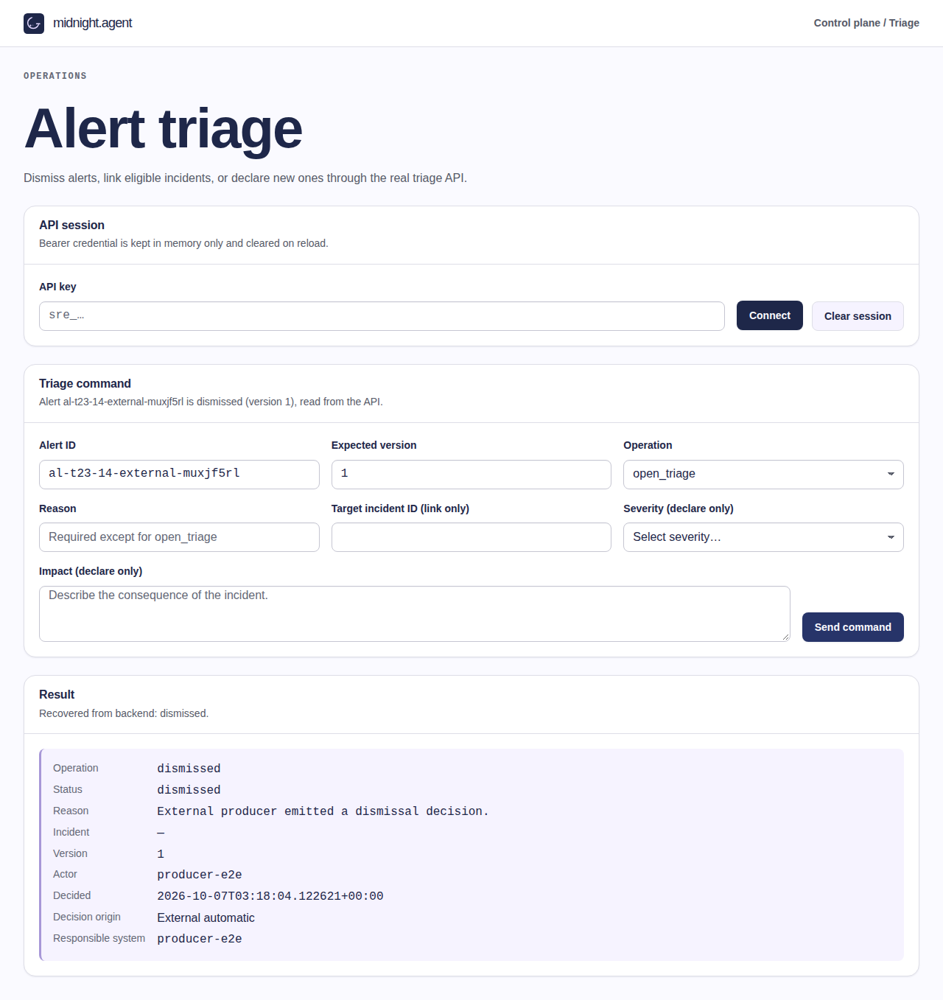
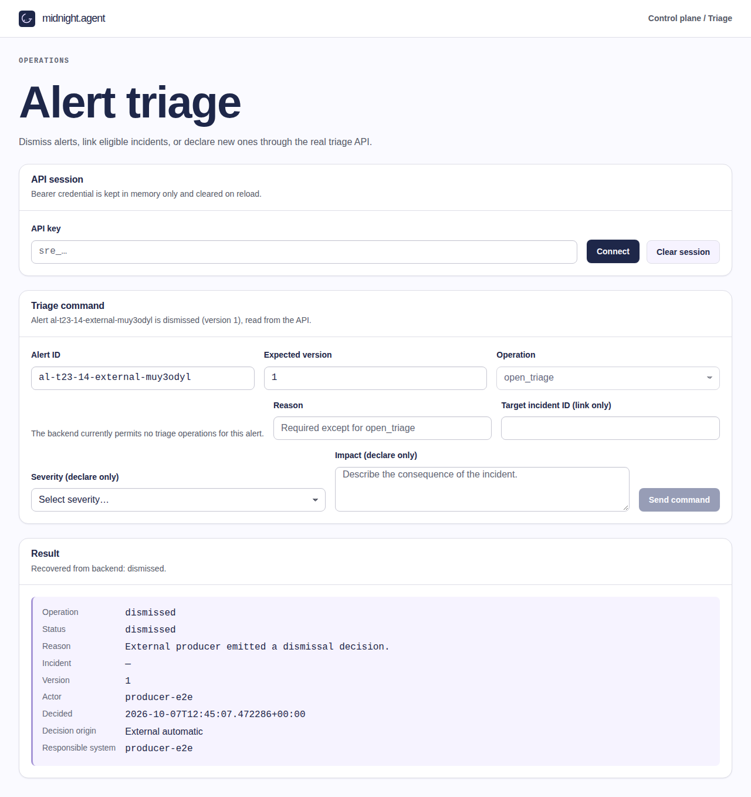
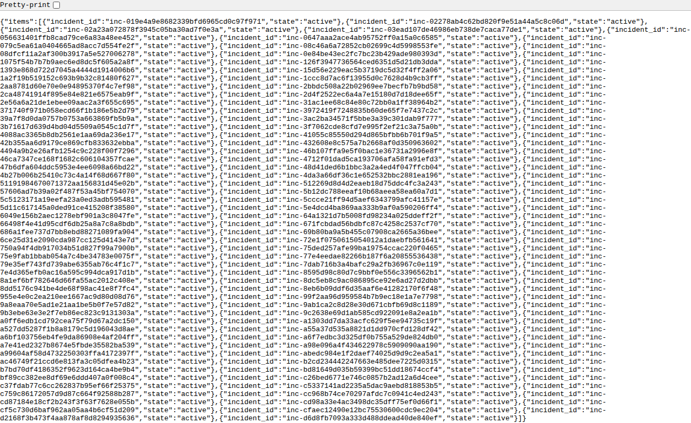

# Issue #23 triage stack review

Status: publication and current-main integration review in progress. The user authorized publication, Codex GitHub review, necessary corrections and merge when ready, plus a size exception ONLY for the final atomic main PR. Issue #23 is not yet accepted or closed. RDD: disabled/unmanaged. Historical local evidence below is preserved, not substituted for fresh integration checks.

## Current-main publication checkpoint (2026-10-07)

Sixteen bounded dependent correction drafts are published as PRs #524–#539, with bounded shared-runtime correction #540; each has a manual Codex GitHub review request. Hosted review/check completion is evaluated separately from requesting it. The original eleven branches remain untouched; no known-broken original slice was merged into main.

Integration base: `31b4d2f8ba3dc292ea9bce59c069ffa21ebfc02f`. Production/browser-tested source: `0d55880bf63d5c4c4e52872b534ce9151244a4dc`; current test-fixture candidate: `5d342c9017e20fd927796d65e299a37358e782f9`. A fresh isolated production package passed **54 tests, zero skipped/failed/flaky, 187.926 seconds, exit0**. Seven new screenshots were individually inspected and are credential-free; generated private keys were absent from four inspected text artifacts. [Dismiss](issue-23-integrated-dismiss.png), [link](issue-23-integrated-link.png), [declare](issue-23-integrated-declare.png), [eligible selection](issue-23-integrated-eligible.png), [external origin](issue-23-integrated-origin.png), [stale recovery](issue-23-integrated-recovery.png), [denied context](issue-23-integrated-denial.png).

The fresh merge first failed during seed because main and triage have sibling Alembic heads `20260928_14` and `20261006_01`. Two populated-history cases were authored before the specific correction; frozen production RED: **2 failed, 5.87 seconds**. A forward no-op merge revision `20261007_01` preserves both parents/data and establishes one required readiness head. The independent integration audit found no concrete P0/P1 in the merge seams; it is not external Codex or human acceptance.

Full integrated checks then observed **1623 passed, 1 skipped, 1 failed, 39 setup errors, 465.78 seconds**, not a passing result. The 39 errors came from existing incident HTTP fixtures omitting the new `alert_triage` table during reset; the textual UI check mistook the contracted `"mitigating"` state for a mitigation evaluator. Only those existing fixtures/check were corrected, preserving assertions and product code. The corrected pre-core full repetition passed 1663 tests with one opt-in live OpenRouter skip (327.24s, exit0). This result is not attributed to the later shared-runtime correction. The successful browser run is not relabeled as a run on the later test-only commit: runtime, UI, browser tests and package bytes are unchanged.

Known nonblocking P2 limitations: denied-context target status can retain loading copy; readiness reads one Alembic row and could miss an extra manually introduced head. The supported populated-history tests establish a sole merge head; no supported rollout producing that extra state was demonstrated. No threshold/origin inference or automatic declaration is introduced. Final hosted checks, external reviews, exact-candidate human acceptance and merge remain pending.

Normal Git publication repeatedly returned a repository-specific Internal Server Error; no global outage is claimed. The standard official Git REST API using the same authorized gh session published exact blob/tree/commit identities, verified against local hashes, without changing credentials, protections or using forced updates. No memory writes were made: runtime registration remains unavailable.

## GitHub review and latest exact-source verification (2026-10-07)

Codex found a genuine CA3 P1 outside the alert adapter: direct HumanCommand declarations could omit impact. PR #540 (`0149defc9af0c08b302f3f00152974979abc6524`) validates a nonblank string of at most2000 characters before mutation and persists exact text. Strengthened existing PostgreSQL behavior was authored first: independent RED1failed4.34s. A first target-wide result guard broke13 legacy later transitions; that actual failure is retained, and the guard is now limited to new declarations without inventing historical impact. Final related GREEN35passed18.12s, exit0.

Fresh full default Docker checks on `a14a0fe5e37b3da27f7fad14e5d69d9bcb2fffeb`: **1663 passed, one opt-in live OpenRouter skip, 429.74s, exit0**; ShellCheck/Ruff/format/import boundaries/mypy and Alembic check also passed. Fresh isolated production package at the same source: **54 passed, zero skipped/failed/flaky, 133.661s, exit0**. The seven integrated screenshots above are now the actual refreshed captures from this run (empty credential input); four text artifacts contain none of the generated synthetic credentials. Shared-core impact is proved by PostgreSQL state/event assertions, not the triage-result screenshot, which does not display persisted incident impact.

Main advanced to `9c5c1765e4c39538609ad8e3d55009dfaee1b155` while checks ran. Its eight issue419 replay documents/helpers were preserved in merge `56cb0c35ad1936a5c04720a46b3eb31a24429cfc`; no runtime, UI, browser-suite or package bytes changed. Corrected #539 ancestry was merged without any file changes; no original stack history or current-main work was discarded.

Further current-head Codex P1s: a newly introduced implementation-spelling assertion is a prohibited change-detector; integration-only origin/context/eligible specs are discovered by the static showcase runner without required credentials/services. Existing isolated T23 selection already includes all nine suites, so the intermediate eligible allowlist omission is superseded, but static selection still requires correction. The actual focused static RED failed at missing fixture credentials. Bounded correction #545 (`8e1a06984040463c6e8a98e22b99ef04a7a83a25`) excludes only those three suites from static discovery and removes only the newly introduced spelling assertion. Static GREEN: **80 passed, 80 existing seed-dependent skipped, 2.3 minutes, exit0**. Existing Python UI module: **7 passed, 0.23s**, Ruff/format passed (first read-only cache failure retained, rerun --no-cache). All nine isolated T23 suites and their54-case zero-skip receipt remain intact. Codex #540 completed at0149def with no major issues; #545 review and final exact-candidate default checks are pending; the historical no-P0/P1 local verdict below is not a global acceptance claim. All PRs remain drafts and their governance status is failing intentionally; a successful reconciliation workflow is not passing governance. No merges or final human acceptance yet.

The complete current-test repeat observed **1662 passed, one skipped, one failed, 328.86s**: the preexisting harness separation guard still required the exact old two-item static-ignore literal. Codex #545 independently reported that P1. The existing case now checks required suite membership rather than the exact spelling/order, preserving production/static separation and all assertions about selected surfaces; existing harness module **10 passed,0.42s**, Ruff/format passed. No new test case was added. Final complete repetition and new exact-head Codex review are required; the earlier human question namingf164 is not acceptance of a later head.

## Historical local verdict before GitHub review (2026-10-07)

The reviewed local correction candidate has **no remaining concrete P0/P1 findings in the final backend/UI audits**. The original eleven remote PRs are still OPEN; their green hosted checks do not cover these unpublished corrections. Confirmed fixes include link-versus-close serialization, terminal incident identity preservation, stale/context/session recovery, human-only declaration with mandatory operator impact, explicit backend provenance, backend-authorized actions, eligible selection and same-ID inbox navigation.

Tested source: `2049c2a3afc96d403da851abdd5e28669c15d182`. Stack base: `63ebc6198a0ca5ce257f1826060bb6345d96b095`. Final independent fresh Docker package: **54 passed, 0 skipped, 0 failed, 0 flaky; 173.906 seconds; exit0**, nine suites. Source manifests match before/after execution. Actual backend source/contract/tests still match tested `a571078da80aa0b899ab99c281166bfabea6db0a`: **114 passed, 38.85 seconds, exit0** using public configuration. See [machine-readable identities, hashes, versions and results](issue-23-final-verification.json). All application/package tools ran inside repository containers; the host wrapper supplies only Docker orchestration and safe private configuration. The final package removed only its own tmpfs database/network; shared evidence databases and other projects were untouched.

| Criterion | Verifiable scenario and source | Observed result |
| --- | --- | --- |
| CA1 | `triage-eligible.spec.js`: inbox dismiss → explicit command → reload → real state GET; `test_triage_commands.py`: replay/conflict checks | Same alert, durable reason, authenticated actor and timestamp; one terminal decision. [Reload screenshot](issue-23-inbox-dismiss.png). |
| CA2 | Real UI bounded list → select → link → state GET; `test_eligible_incidents_caps_in_deterministic_order_and_excludes_terminal_states` | Up to100, stable ordering; no closed destinations; untriaged IDs supported. [Selection](issue-23-eligible-selector.png), [linked reload](issue-23-inbox-link.png). |
| CA3 | Inbox declare/reload exact incident ID + incident detail GET; `test_declare_persists_operator_impact_through_http_state_event_and_replay`; `test_declare_accepts_every_contract_severity` | Mandatory exact impact persists in state and initial event, severity retained, same incident after reload/replay, one initial event. [Declared reload](issue-23-inbox-declare.png). |
| CA4 | Real same-key replay/SQL counts and both link/close lock orderings; `triage-conflict-recovery.spec.js` real winning-version read then explicit retry | No duplicate incident/event;409 refreshes authorized context and retains reason/current eligible target; no automatic retry. [Recovery](issue-23-recovery-final.png). |
| CA5 | Real grantless403 browser/HTTP; `test_context_fails_closed_when_real_policy_storage_is_unavailable`; eligible restricted-role storage503; injected browser empty/403/503/malformed/late responses | No false success or unauthorized effects. Real PostgreSQL denial tests backend faults; injected browser cases prove presentation only. [Denied context](issue-23-denial-final.png). |
| CA6 | `triage-origin.spec.js`: actual authorized producer dismiss/link HTTP → UI/reload, manual declaration, genuine pre-migration legacy row | Backend validates `manual`/`external_automatic`/`unknown`; responsible producer shown, no UI thresholds/origin inference. Agents cannot declare/open. [External decision](issue-23-origin-final.png). |

CA2 backend executable cases are `test_eligible_incidents_caps_in_deterministic_order_and_excludes_terminal_states`, `test_eligible_list_then_closed_destination_is_rejected_without_association`, and the two real concurrent lock-order checks in `test_triage_link.py`. The browser `destination_ineligible`409 is injected: it proves refreshed choices, cleared target, preserved reason, disabled submission until explicit selection, and no automatic POST; it does **not** masquerade as the real SQL-close race.

The inbox is a real nginx-served **synthetic JSON fixture**, not live provider ingestion. Producer credentials are synthetic authorized agent credentials; their decisions actually traverse FastAPI and PostgreSQL. The project has grant-based authorization, not a separate threshold evaluator: CA5 demonstrates absent grants and real policy-storage failure without inventing one.

### Environment and repeatable Docker commands

Python3.12.14, FastAPI0.115.12, SQLAlchemy2.0.52, psycopg3.2.6, Alembic1.19.1; digest-pinned PostgreSQL17.4 and repository Dockerfiles/lockfiles. Exact built image IDs are in the JSON receipt. For the browser run, safely prepare `/tmp/triage23-local` and its empty `artifacts` directory with owner-only permissions700, an empty `artifacts/credentials.env` file600, and a private `compose.env` file600 containing:

```ini
COMPOSE_PROJECT_NAME=triage23-local-unique
T23_ARTIFACTS_DIR=/tmp/triage23-local/artifacts
T23_CREDENTIALS_FILE=/tmp/triage23-local/artifacts/credentials.env
```

Choose a unique project name and empty artifact directory per run. The committed seed creates six synthetic identities, a real legacy row before migration, and one eligible target; no missing temporary seed, real provider credential, published port or ambient `.env` is required. Do not print/source/commit the generated credential file. From the tested checkout:

```sh
docker compose --env-file /tmp/triage23-local/compose.env -f compose.triage23.yaml build db seed api web e2e
docker compose --env-file /tmp/triage23-local/compose.env -f compose.triage23.yaml up -d db
docker compose --env-file /tmp/triage23-local/compose.env -f compose.triage23.yaml run --rm --user "$(id -u):$(id -g)" seed
docker compose --env-file /tmp/triage23-local/compose.env -f compose.triage23.yaml up -d api web
docker compose --env-file /tmp/triage23-local/compose.env -f compose.triage23.yaml run --rm --user "$(id -u):$(id -g)" -e HOME=/tmp e2e sh /run/triage23-browser.sh
docker compose --env-file /tmp/triage23-local/compose.env -f compose.triage23.yaml down --remove-orphans
docker compose --env-file .env.example -p triage23-local-checks --profile checks run --build --rm -T python-checks pytest -p no:cacheprovider -q tests/test_triage*.py tests/test_incident_runtime.py tests/test_incident_persistence.py
```

Expected: browser54/0/0/0 with real screenshots and recordings; backend114 passes. Always perform scoped cleanup after a failed browser run too. When Docker's default pool is exhausted, inspect a free private subnet, add `T23_NETWORK_SUBNET` to private configuration and add `-f compose.triage23.network.yaml` to each browser Compose command. Never reuse another project's db/api/web aliases or prune its resources. The equivalent `scripts/run_triage23_review.sh` wrapper automatically creates private configuration and cleans up its own project even on failure.

### Evidence, retained failures and delivery boundaries

Final private run: `/tmp/triage23-20261007T142216Z-1594216.KB6ZMK`; logs/manifests: `/tmp/triage23-review/t23-18/parent-final-corrected`. Seven committed screenshots were visually inspected; eight final text artifacts contained none of the generated credential values. Three genuine inbox WebM clips exist under `artifacts/test-results/triage-eligible-real-inbox-*/video.webm`; start/middle/end samples were inspected in isolated Docker Chromium, with no visible credential value. Samples are not a full-frame certification. These recordings are not published; browser fault-case recordings must not be labeled real-service proof.

Deferred: media storage unavailable; screenshot evidence is mandatory.

Retained latest failures: baseline UI8fails; first GREEN53pass/1copy mismatch; initial weakly ordered conflict race passed (not conclusive), strengthened deterministic worker/parentRED1fail then focusedGREEN1pass; first parent static attempt hit a read-only Ruff cache, then E501 on fixture message, then first line-wrap still exceeded100. Final adjacent-literal formatting passed Ruff/format and shell syntax; Node syntax passed in Docker. Parent package before that purely mechanical formatting change also54passed128.330s; **the final173.906s run uses the final formatted commit**, not substituted earlier results. All functional final cases ran; none skipped. ShellCheck was unavailable locally and was not claimed. Earlier retained failures are detailed chronologically below.

Nonblocking UI copy follow-up: after a denied context read, target-list status can retain its loading message even though the main error is visible and command submission remains disabled. This is not a P0/P1 or false success.

Local latest bounded units: target UI/existing fixtures210lines (`d9ccd46`), inbox/pre-authored E2E389 (`0eaf902`), package19 (`0a82cde`), fixture-format5 (`2049c2a`), additions plus deletions. No size exception, push, PR publication, merge or issue closure. Hosted CI for the new candidate and independent human acceptance remain pending; RDD is disabled/unmanaged. Engram synchronization is pending runtime session registration, not simulated by another identity. Local tracker and this report preserve recovery.

## Scope and identity

Review date: 2026-10-06 (America/Bogota). Authoritative issue: [#23](https://github.com/creep1ng/sre-agent/issues/23), OPEN, Project [midnight.agent #8](https://github.com/users/creep1ng/projects/8), Todo, Estimate 5. Latest user goal targets #23, replacing the initial #330 reference.

Fetched and inspected the exact linear, currently OPEN stack:

| PR | Current head (short display only) |
| --- | --- |
| #373 | 7990109 |
| #374 | a832ad1 |
| #380 | 33992ef |
| #389 | 8dc94a7 |
| #391 | 759fade |
| #392 | e0bb235 |
| #460 | ecad5e3 |
| #463 | 94dff87 |
| #464 | 40f181b |
| #466 | 724b868 |
| #485 | df17a07 |

Stack base: `63ebc6198a0ca5ce257f1826060bb6345d96b095`. Baseline tested head: `df17a07edb8259671763f1ba9e8cfa4e763365bf`. Original checkout: `fe6fca024fec4f89f7538dc5dc03159a99f12a2a`, preserved rather than silently rebasing this divergent stack. Local corrections use `codex/triage-23-stack-review`.

Live hosted checks were successful for all eleven PRs at inspection; this is separate from local behavior proof. The production Playwright config includes `triage.spec.js` but omits the added real recovery/persistence/403/session suites. PR #485 reproduction requires an unavailable `/tmp/seed-c3e.py`, so its commands alone are not repeatable from that commit.

## Baseline observed checks

- Python: **45 passed**, 18.32 seconds: existing store, command, declare, HTTP, contract and UI checks. No new unit tests were added after implementation.
- Browser: **30 passed**, 51.8 seconds, no skips: 17 real nginx/FastAPI/PostgreSQL persistence, recovery, 403 and session-isolation journeys; 13 route-mocked UI checks. Do not describe the latter as real service evidence.
- SQL readback: 13 durable triage rows with synthetic actor and timestamp; five declared incidents with `sev2`/`sev3`, **all five impact values JSON null**, and five rows in `incident.run_events`.
- Real, locally produced session-isolation and 403 screenshots were inspected; credentials were not printed or included in screenshots/traces.
- Initial ad-hoc SQL used the wrong `version` column and nonexistent `incident.events` table; those queries failed and were corrected to `expected_version` and `incident.run_events`. They are not product failures.

## Baseline requirement audit (historical, not acceptance)

| Criterion | Current evidence | Remaining work |
| --- | --- | --- |
| CA1 durable dismiss, actor/time/reload | Real dismiss/recovery journeys and SQL readback pass | Bind final correction candidate and durable reproduction |
| CA2 eligible target list and rejection by ID | Backend sequential rejection exists; no list handler or selection UI | Implement contracted listing; verify link-versus-close race and real selection |
| CA3 declare ID, severity/impact/event/reload | Real declaration/reload and SQL event/ID/severity proof | Impact is explicitly unresolved in contract and null in runtime; product decision required |
| CA4 no duplicate key effects; conflict refresh/context | Existing backend idempotency/CAS checks pass | Authorized GET recovery now passes real browser proof; terminal rewrite is now rejected with identity/replay preserved; full criterion matrix remains pending |
| CA5 403/missing policy/evaluation failure without false success | Real grantless 403 and absent persisted decision pass | Demonstrate missing-policy/evaluation-failure paths; do not invent an evaluator |
| CA6 manual versus external automatic distinction | No browser anomaly/threshold evaluator; actor displayed | No decision-origin projection or external automatic evidence; authoritative contract required |

At the baseline, two further explicit integration requirements were unmet: `public/incident-ui/alerts.js` only emits an unconsumed `midnight:triage-requested` event; no inbox→triage navigation exists. The triage UI hardcodes every operation instead of consuming domain-provided permitted actions. The direct-URL browser journeys above do not prove inbox journeys. Alert source metadata is not automatic decision origin.

Additional **P1 confirmed through real HTTP**, corrected below: one synthetic alert received `triage_declare` 201/version1, then `triage_dismiss` 200/version2/incident_id null, then `triage_declare` 201/version3 with a *different* incident ID. The current guard rejects repeated declare only while the status is still declared; another command can erase that guard and canonical association. Captured safe output: `/tmp/triage23-review/terminal-probe.log`. Workflow triage decisions have terminal destinations; the browser must not invent another state machine to cover this service failure.

## Corrected P1: link versus concurrent close

`TriageService._transition` read destination eligibility through a non-locking MVCC SELECT. A closer could commit a closed state while the linker still held an earlier eligible snapshot, then the linker persisted success. This violates CA2's revalidation guarantee. `FOR UPDATE` now holds the incident row through the same transaction as the triage write: a close that wins is observed and rejected with 409; a link that wins completes before the close.

Failure cases were written before production code. Parent independently repeated the final tests with baseline service bytes: **RED 2 failed / 3 passed**, 9.61 seconds. Corrected current candidate: **50 passed**, 14.04 seconds across all existing triage Python suites and the two concurrency cases. Worker targeted GREEN5passed after refactor; Ruff check/format and diff whitespace checks pass. The real database gate controls transaction ordering, not eligibility results. Early harness hangs were diagnosed and cleanup made bounded; those attempts are not RED evidence.

Verified source SHA-256: service `e8931db283e8fd93ddce119f93c72375f4a9dbbda67b58055105cdd75c80bab5`; test `a30050285d1f7816ea9bd644e69ec33c41a6d05000f9823b1c3110632e39e49d`. Parent logs: `/tmp/triage23-review/t23-1-parent-final-red.log` and `t23-1-parent-final-green.log`. This corrects the concurrent-ID acceptance defect, **not** the still-missing eligible-target list.

For standalone reproduction, prepare an owner-readable local `.env` from `.env.example`, supplying all required local non-production keys and routing values; do not print, attach or source it. This command uses the existing dedicated `python-checks-db`, not the runtime database. Select a unique Compose project; never globally tear down volumes:

```sh
docker compose -p triage23reviewchecks --profile checks run --build --rm python-checks pytest -p no:cacheprovider -q tests/test_triage_link.py
```

Expected: five passed, including both concurrent orderings and already-ineligible destination rejection. Observed: the standalone command first failed before execution because this host's Docker address pools were fully subnetted. No unrelated networks were pruned. Reusing the existing owned internal network through a temporary external-network Compose override, the actual candidate Dockerfile build and same command passed **5 tests in 3.95 seconds**, image `sha256:d1833bdf37c29ddc0d9ff321c1d6e238998e41852c4de467374656e888b5a59b`. Logs: `/tmp/triage23-review/t23-1-compose-reproduction.log` (host failure) and `t23-1-compose-owned-network.log` (successful reproduction). This infrastructure-only variation does not alter database/test inputs. The prepared `.env` and Docker/Git are host prerequisites; pytest and dependencies run only inside Docker. Rollback: revert the target-row lock correction; concurrent eligibility protection is then lost.

## Environment and evidence boundaries

Docker 29.8.2; isolated internal network `triage23-review-c25c`; tmpfs PostgreSQL 17.4 (pinned repository digest), no published database port. API and nginx web publish loopback only (28423/28424). No shared databases, existing stacks or ambient `.env` were used.

Cached checks image `sha256:698d015a7a95b2a20e342b96d1681fb604d8cf7dc497328530d2ba14438cd0ab` supplies dependencies, **not application source**: candidate mounted read-only at `/candidate`, `PYTHONPATH=/candidate/src`. Its lockfile and project metadata match candidate SHA-256 `783c78b44e4ab07091d0ee1d44a693b77f1ec0fdc94f9aa3c0e212cd34dc878b` and `aeabf158a6732df42a8dc71fb1aa30f62b89512b371f05aba8f6374dba7f0b33`. Browser image `sha256:3d6c1a422c8550ecbef61c78ab99b306e6e41380cfd853074ac8158194092f59` has Playwright 1.63.0. nginx is built from the candidate Dockerfile.

Private local recovery artifacts: `/tmp/triage23-review/baseline-python.log`, `baseline-browser.log`, `baseline-authoritative-corrected.sql.txt`, `browser-artifacts/evidence/`. Synthetic credentials reside only in an owner-readable private file and must not be attached. These temporary paths are **not** a durable published reproduction package. Repeatable repository commands and final candidate-bound media remain pending.

No push, publication, merge, issue closure, scope exception or human approval has occurred. All pending criteria above remain pending even though baseline tests pass. See [the task document](../../odd/tasks/triage-23-stack-review.md).

## Corrected P1: stale conflict recovery and session generation

After 409 `stale_version`, the UI now performs an authorized GET, displays current API state/version while preserving the operator draft, and requires explicit resubmission. A failed read retains the conflict without inventing current facts. Connecting another identity resets its command gate; an old response cannot overwrite or unlock the new generation.

Worker observed RED before recovery and generation fixes, then GREEN23passed. Parent independent final run: **34 passed in 56.4s**, no skips (21 real nginx/FastAPI/PostgreSQL integration journeys and 13 route-mocked UI checks). Both JavaScript syntax checks and diff whitespace checks passed. UI SHA256 `75307d81f364cef6d4423d3a4f7e4e479111d9cc5921cbfd996c10c4ec5e78e1`; new spec SHA256 `60083ba8b7d85933c9dfcbd4d89ac6c7b46d5be4d8acfb21c15f9a85cfb30267`. Parent log `/tmp/triage23-review/t23-2-parent-all-browser.log`.


The screenshot was inspected: synthetic identifiers/reason, credential field empty, conflict notice and API version2 with draft intact. Reproduction setup is still temporary; T23-5 must package seeds/config and bind the final candidate before acceptance. Rollback: revert the UI recovery/generation correction; authoritative recovery and switched-session command availability are then lost.

## Corrected P1: terminal identity rewrite

Fresh commands can no longer overwrite dismissed/linked/declared triage decisions. The guard follows authorization, idempotent replay and version checking; original replay results are preserved. Existing `already_declared` and target `destination_ineligible` errors remain compatible. Previously declare→dismiss→declare erased the canonical association and created a second incident.

Real HTTP/PostgreSQL behavior cases were written first. Parent independent RED with prior service: **3 failed / 1 passed in 6.47s**. Corrected final complete Python triage suite: **54 passed in 14.41s**; Ruff check/format and whitespace checks pass. Parent first format check failed for the new HTTP test; it was formatted and the final complete run succeeded. Worker initial RED command used an incorrect Alembic working directory and yielded spurious 503s; that attempt is not behavior RED evidence.

Service SHA256 `3776bcc947ef2c70537dc5a855bead077debf60b4e3d084bb55dc739e66c9fd9`; HTTP test SHA256 `8638909af5dc8e8e572a21e15091e5bcd0e9d0ce25b83fd129a8fced817c996b`. Parent logs `/tmp/triage23-review/t23-7/parent-red.log` and `parent-green-final.log`. Containerized reproduction uses the same dedicated checks setup described above:

```sh
docker compose -p triage23reviewchecks --profile checks run --build --rm python-checks pytest -p no:cacheprovider -q tests/test_triage_http.py
```

Expected:16 HTTP checks pass, including terminal rejection, unchanged authoritative state/incident count and original declare replay. The parent observed these inside the54-check complete run with the candidate mounted read-only and matching cached dependencies. A fresh actual Compose candidate build, with only the owned external-network override previously described, also passed **16 HTTP checks in10.17s**, checks image config `sha256:6d6ee9bcf7112399fe9f8be76cd00a4bfc01f8d73cc9aa242b00c11eca990cff`. Log `/tmp/triage23-review/t23-7/parent-compose.log`. Rollback: revert the guard; terminal rewriting and duplicate declarations become possible again. No historical data was rewritten.

## Remaining authority and acceptance boundaries

Final scoped gh reread confirms issue23 OPEN/ProjectTodo and PR485 head `df17a07edb8259671763f1ba9e8cfa4e763365bf` unchanged. The issue expressly excludes new backend endpoints within a UI-only HU and leaves the HTTP/rubric owner decision open. The absent eligible-list implementation, inbox handoff and domain action projection are unmet requirements, not permission to silently invent missing APIs. CA3 impact and CA6 external automatic decision origin require authoritative definitions. No threshold detector, evaluator, impact policy or automatic-origin mapping was invented. Full issue23 acceptance, missing-policy/evaluation-failure proof, durable setup packaging and human acceptance remain pending.

Final browser rerun after loading the terminal guard: the first attempt immediately after API restart produced **1 failed /33passed** (grantless command showed Request failed rather than403). Exact transport cause was not captured; do not silently classify or discard that failure. After independently confirming API readiness200, the unchanged candidate repeated **34/34 passed in1.1m**, no skips (21real,13mocked). Logs `/tmp/triage23-review/t23-7/parent-final-browser.log` and `parent-final-browser-ready.log`. This is a successful second observation, not proof that the first failure never occurred.

## Accepted CA3 definition and corrected backend impact

User defines impact as the consequence of an incident, obligatorily established by the operator. New declarations now require nonblank impact text of at most2000characters; the exact submitted text is persisted in incident state/event and projected by the incident GET. No impact rubric is computed and legacy impact is not invented. The command schema/API source version is2.0.0 for the breaking requiredfield; published release snapshots remain untouched.

New genuine HTTP/PostgreSQL cases precede production changes: valid2000-character impact, missing/null/type/empty/whitespace/overlong rejection without persisted decision/incident/event, authoritative GET/SQL and same-key replay with one event. Parent final baseline-overlay RED:**30failed22passed11.73s**. Parent exact candidate GREEN:**75passed19.84s** across triage/runtime, Ruffcheck/format7files and whitespacecheck pass. Parent logs `/tmp/triage23-review/t23-9/parent-{red,red-final,green-final}.log`. WorkerfirstGREEN50passed2failed due two incomplete fixtures; existingfixtures were corrected after source without new unit coverage. Its original failedGREEN log was accidentally overwritten and is unavailable; no output was reconstructed. A read-only cache-path Ruff attempt also failed before rerunning with container-local cache.

Service SHA256 `df9a9ecf9b8fd40fef61011087efa9718b43992c76e569892198c7539ce8a50f`; runtime SHA256 `e537ad70a3684c978710686b855d4074df6c3c4da411089b67c30b318d0d2ce4`; HTTP test SHA256 `0a238291eb4cb032e599c2abed0ea1422cb1c2561acd072bb26e5a7fa38418e2`. Reproduction uses the same isolated checks prerequisites/network described earlier:

```sh
docker compose -p triage23reviewchecks --profile checks run --build --rm python-checks pytest -p no:cacheprovider -q tests/test_triage_http.py tests/test_triage_declare.py tests/test_triage_contract.py tests/test_incident_runtime.py
```

This new impact unit has only been independently run with matching cacheddependencies and read-only source, not yet a fresh Composebuild. Manual UI/client changes and agent-to-human actor authority correction remain pending; do not claim fullCA3 or CA6accepted. Rollback removes mandatoryimpact and its reducer assignment, losing this new CA3 guarantee.

## Corrected P1: agent credentials represented as a human operator

Real baseline commands by an active, granted agent returned200dismiss,200link and201declare, despite the workflow permitting only humans for terminal triage. Parent SQL then showed `principal_kind=agent`, stored runtime decision `actor=human`, and `actor_reference=producer-agent`. This was false actor authority, not evidence of an automatic origin.

The manual command service now checks the authenticated principal kind after action grants (including link run.read) but before idempotent binding. Nonhuman terminal manual commands return403`operator_required` without triage/incident/event effects. Open-triage and reads are unchanged; no automaticterminal permission or workflowactor was silently enabled.

Failurecases preceded production changes. Parent baseline RED:**3failed23deselected5.93s**. Parent corrected complete triage/runtime suite:**78passed19.92s**, Ruffcheck/format2files and whitespacepass. Workerearlylinkfixture missedrun.read and was corrected before final RED. Logs `/tmp/triage23-review/t23-12/parent-{red,actor-sql,green}.log`. SourceSHA256 `a9c575a5b3463ae5099f3889e4897e7d88031e8a61ab0547049344d65990dfc7`; HTTPtestSHA256 `6c5eb21c28ce5ee690fcf54d45de579420621dbca69436d1e2fef31c0737b19f`. Use the existing DockerCompose HTTP reproduction command above; a fresh Composebuild of this new actor unit is still pending. Rollback allows an agent to impersonate a human in terminal triage again.

## Real CA5 policy and evaluation-fault probe

Independent FastAPI/PostgreSQL evidence (no mocked responses): removing the isolated workflow policy resource/grants returned403 `not_authorized`; a newly created synthetic database role authenticated successfully but had no SELECT permission on grants, producing503 `storage_unavailable`, retryabletrue. Neither request changed triage, incident, event or idempotency row counts. Only the synthetic role was removed afterward. No browser threshold/rubric evaluator was invented.

Actual output is `/tmp/triage23-review/t23-5/ca5-real-probe.log`; setup is `/tmp/triage23-review/t23-5/ca5-real-probe.py`, executed with `docker run` against the separate owned checks database. These temporary artifacts prove backend fail-closed behavior, not a durable published reproduction package or complete browser CA5 acceptance.

## Verified CA3 UI integration and current candidate checks

Manual declarations require nonblank operator impact (max2000); exact text is sent only for declare, preserved through stale recovery and cleared with session context. Real browser journeys read the same impact from incident detail after navigation, reload and a second session. No UI impact rubric or origin inference exists.

Observed pre-source RED: old UI lacked the impact selector. Worker first full candidate run35passed1failed from a lowercase-only assertion against `Impact`; corrected case-insensitive assertion and repeated36passed54.9s. A broad run against old bundled nginx was stopped, then the owned nginx image rebuilt. Parent independent final browser repetition:**36passed1.1m**, no skips (21real integration,15route-mocked UI checks). Parent first invocation failed before tests because the artifact directory was not writable; preserved and repeated with the host UID.

Fresh actual candidate Composebuild passed **78 Python checks in27.30s**, image `sha256:5d1cf8b37b03ac9247e57469dcb447d7b764fa4bf3515c760148471c778b3252`, including current impact, actor authority, concurrency, runtime and static UI cases. Initial command referenced nonexistentdocker-compose.yml and failed before build; corrected tocompose.yaml. This supersedes the fresh-build-pending status of the earlier backend/actor units above.

```sh
docker compose --env-file <private-local-checks-env> -p triage23reviewchecks -f compose.yaml -f <owned-network-override> --profile checks run --build --rm python-checks pytest -p no:cacheprovider -q tests/test_triage_commands.py tests/test_triage_http.py tests/test_triage_declare.py tests/test_triage_contract.py tests/test_triage_link.py tests/test_triage_store.py tests/test_triage_ui.py tests/test_incident_runtime.py
```

Use the isolated local configuration/network prerequisites already described; angle-bracket paths are explicit prerequisites, not supplied artifacts. Logs `/tmp/triage23-review/t23-10/parent-{compose,browser}.log`. Durable self-contained seeds/browser reproduction package and human acceptance still pending; no hosted CI result is claimed for these local changes. JavaScript syntax, static UI checks and diff whitespace checks pass.


Parent inspected this real screenshot: synthetic incident/operator, impact consequence, severity and initial event; no credential shown. Screenshot SHA256 `30a3da5cd5f40026d056766c149b5ca8a9672567497f911365ee3d03c95644bc`; UI SHA256 `1c2e3d0b6bb72976ab920ffff8f75384faaa49a18a844ceef3281beffae84cf5`. Rollback removes impact entry/validation from UI and makes new declarations incompatible with the mandatory backend field. CA6 producer outcome authority is still unresolved; no external automatic terminal journey or full issue23 acceptance is claimed.

## Accepted external outcome policy and durable provenance storage

User annotation1 authorizes external automatic dismiss/link only; declare remains exclusively manual with mandatory operator impact. External decisions are scoped to the pre-incident alert-triage adapter, not direct incident runtime commands. Existing dismiss/link paths do not execute IncidentRuntime; only declare does. Its workflow version and actor policy remain unchanged. Subsequent API contracts must document this boundary explicitly.

Migration20261006_01 descends the actual triage head20260923_13. It stores decision_origin with manual/external_automatic/unknown checks and nullable responsible_system; all existing rows backfill unknown/null without inferring from historical actor IDs or current principal kind. ORM/storage match; required readiness head advances, and populated sibling-history union handling remains active. Downgrade refuses to discard known provenance.

Parent independent baseline-overlay RED:**3failed8.67s**; final current candidate eight-module GREEN:**101passed79.26s**, no skips. Matching cacheddependencies/read-only candidate source, isolated checks database. Logs `/tmp/triage23-review/t23-13/parent-red.log` and `parent-green-full.log`. Worker focused RED3failed10.72s/GREEN3passed10.10s. Worker accidentally left earlier exec sessions running and overlapped destructive schema resets; durable broad log15failed57passed29errors113.65s, later95pass6fail131.97s stream not durably captured. Shared redirection contaminated the log; no output reconstructed. Parent verified no leftover test containers before an independent single sequence. Ruff lint/format and whitespace checks pass.

Containerized command for those same modules (isolated configuration/network prerequisites above):

```sh
docker compose --env-file <private-local-checks-env> -p triage23reviewchecks -f compose.yaml -f <owned-network-override> --profile checks run --build --rm python-checks pytest -p no:cacheprovider -q tests/test_triage_store.py tests/test_skill_migration_compatibility.py tests/test_migrations.py tests/test_health.py tests/test_incident_persistence.py tests/test_demo_seeds.py tests/test_consumption_reservation_persistence.py tests/test_bok_http.py
```

This storage unit has not yet had a fresh Composebuild independently rerun. Actual observed run used matching cached dependencies with read-only current source. No HTTP response fields or external decision authority/UI were changed in this unit, so **CA6 remains pending**, not accepted by migration alone. Rollback is refused when it would erase known provenance; legacy-only rows may downgrade.

## Verified external producer HTTP decisions and explicit provenance

The existing command API now accepts an authenticated agent only for exact-granted dismiss/link (plus run.read for link). Backend persists external_automatic and responsible_system from authenticated producer ID; human decisions persist manual/null. Agent open/declare remain denied even with action grants. Request-supplied origin/system claims are rejected by the closed body schema. Legacy GET/idempotent replay remains unknown/null, never inferred from historical actor. API source3.0.0/state schema2.0.0 reflects the breaking strict response shape; command2.0.0 and immutable published snapshots are untouched. Incident workflow/runtime actor policy is unchanged: these are alert-adapter dispositions, not run transitions.

Parent genuine baseline-overlay RED:**5failed3passed16.88s**. Final current full triage/runtime GREEN:**85passed51.65s**, no skips. First parent overlay used incorrect before-copy paths and continued against current code (7passed29deselected27.42s); it is **invalid RED**, retained as setup failure. Corrected fail-fast copy paths, matching baseline source hashes and pytest configuration before the valid repetition. Worker observed RED5failed3passed7.51s, focused36passed14.76s, full85passed27.88s; initial RuffE501 failed then line-wrap refactor passed. No failed log was discarded.

Parent real separate producer container called live HTTP: old loaded API403operator_required; after quiescent restart and explicit readiness200, the same request returned200 with external_automatic and producer-e2e. Actual authenticated GET displays persisted provenance:


Inspected real screenshot: synthetic response only, no authorization headers/credentials. Source service SHA256 `ebf000ff2a9ab2868eb0ca851f27e262ea969c74969f94dcd4c3b836964884dc`. Logs `/tmp/triage23-review/t23-11/parent-{red-final,green-full,live-http-red,live-http-green,api-readiness}.log`. Browser database migration separately preserved206 real synthetic legacy rows exactly and classified all as unknown/null. Producer credentials stayed in a private owner-only file; initial private-directory permission failure occurred before writes and was corrected by hostUID, not relaxed permissions.

Containerized full triage/runtime reproduction uses the same isolated prerequisites described above:

```sh
docker compose --env-file <private-local-checks-env> -p triage23reviewchecks -f compose.yaml -f <owned-network-override> --profile checks run --build --rm python-checks pytest -p no:cacheprovider -q tests/test_triage_commands.py tests/test_triage_contract.py tests/test_triage_declare.py tests/test_triage_http.py tests/test_triage_link.py tests/test_triage_store.py tests/test_triage_ui.py tests/test_incident_runtime.py
```

This new unit has not yet had a fresh Composebuild independently rerun. Matching cached dependencies/read-only source supplied the observed result. UI origin labels and complete durable setup package remain pending; do not claim fullCA6/fullissue acceptance from HTTP proof alone. Rollback removes external dismiss/link authority and provenance response while stored origin remains preserved by the separate migration.

## Fresh committed backend Compose verification

The parent archived exact backend commit `bbf5c974a93366c5a4410510e616d4e092852078` before the UI writer changed the shared checkout. An actual fresh `docker compose ... --profile checks run --build --rm python-checks` executed all `tests/test_triage*.py`, incident runtime, skill migration compatibility, migrations, health, incident persistence, demo seeds, consumption persistence and BOK HTTP modules. **179 passed in 145.21s**, exit0; image `sha256:754ffbad94fb5c6c19a1ef12bb7bf17a73ad0864156413a7f574c8ad57fd9f9a`. Unique log `/tmp/triage23-review/t23-11/parent-compose-bbf5c97.log`. This resolves the earlier pending fresh-build check for T23-11/T23-13. It proves that backend commit, not a future UI/package candidate, hosted CI or full issue acceptance.

## Verified UI decision provenance

T23-14 displays backend origin as Manual / External automatic / Unknown (legacy), and the external responsible-system ID only when explicitly provided. It neither classifies actors nor calculates thresholds. Missing provenance remains unavailable. Session disconnect/switch clears provenance.

Parent independent prior-UI RED: **1 failed**, missing `#result-origin`, after real producer POST200 and external provenance assertions succeeded. Current seven suites: **40 passed in1.7m**, exit0, no skips (25 real integration journeys,15 route-mocked checks). Worker independently observed40passed2.0m. The real external journey uses producer HTTP POST, operator UI GET, reload and disconnect; manual declaration, genuine migrated legacy row and forged/unauthorized requests also pass. Logs `/tmp/triage23-review/t23-14/parent-{red,green}.log`.



Parent inspected this genuine browser screenshot: synthetic alert/system/reason and empty credential field. Source JS SHA256 `9e2d03b4cefee9b3db696558669f3c38c04efbe7879e455f34e5d2b9366c895a`; HTML `7f73a5aeb5d48e4cea4802574a4de127684ae9db204607dc1b2d1013b8c33247`; origin spec `015ec541d3a0ac00995fd339b588ba6f6e1b1d4a07764e350fefce39b518b9cb`. This is local candidate proof, not hosted CI/human acceptance. Containerized fixture packaging, inbox routing, eligible list and domain action projection remain pending. External link has PostgreSQL/TestClient behavior evidence but no dedicated producer network/browser case yet. Rollback: revert UI provenance display; server storage/authority remains unchanged.

## Durable isolated reproduction package (partial T23-5)

The checked-in [guide](triage-23-reproduction.md), `compose.triage23.yaml`, optional network override and `scripts/run_triage23_review.sh` now prepare a fresh internal network/tmpfs PostgreSQL, build the actual pinned API/web/Playwright Dockerfiles, seed only synthetic principals/exact grants, and execute all seven triage suites. Historical row insertion occurs before provenance migration, not on the current schema. Default production browser selection is preserved; only `T23_REVIEW=1` selects these suites. Credentials remain private0600, no published ports/provider keys/ambient `.env`; cleanup targets only its unique project. Dedicated producer-link HTTP→UI journey adds genuine missing behavior coverage before package source changes.

Parent independent final run: **41 passed,0 skipped,0 failed,0 flaky; exit0**. Static Ruff check/format, ShellCheck and whitespace checks passed. Parent source base `456e1eb76fa676a5fac1c4ebf89bad27b8a11fda` plus the uncommitted package; final runtime source hashes: Compose `44fbf8b8aacf22c5c2e98e5f3e9829548c2bf8956d3cf025580b7da3059e82f5`, seed `efee8e70d904dbb8b1899c3bd29b6d3028f2b591b16520cb944cf1e2b5309a97`, origin suite `278900c56be02489ea0dbc32c4e9c32263e8e5322b25bd4ec8135e3caf35bc5d`. Log `/tmp/triage23-review/t23-5-parent-package-final.log`; actual final artifacts `/tmp/triage23-20261007T034235Z-3486186.cB3AS1`. This host's exhausted default address pool required an inspected-unused private subnet `10.253.139.0/24` for a new unique internal network, never parent-network reuse. The wrapper's Docker commands perform reproduction; Git/Docker and safe local configuration are the only host dependencies.

Failed/setup attempts retained: missing-package RED; initial YAML parse failure before services; worker static cache/import/format failures; preliminary41-pass candidate that replaced default suite selection (not accepted, corrected); parent first outer zsh wrapper reserved-variable failure after41passes (not exit proof), followed by the corrected explicit exit0 run. No checks skipped. No full issue acceptance, hostedCI/human review or publication is inferred. Package covers26real integration journeys and15mocked checks, not absent inbox/list/domain-action features or a packaged authorization-evaluation-fault scenario.


Parent inspected real screenshots and scanned final logs/JSON for the generated credential values: none present. Private artifacts still require inspection before sharing. Remaining T23-3/T23-8: eligible-list contract exists but handler/client absent; inbox event has no consumer; domain allowed-action read contract does not exist for alerts without stored triage. The issue's UI-only/no-new-endpoint constraint prevents silently inventing that projection. Rollback: remove scoped package/config selection; default production suites and application runtime are unchanged.

## Authorized backend allowed-action context (T23-15)

On2026-10-07 the user explicitly authorized the backend-read scope expansion. New `GET /v1/alerts/{alert_id}/triage/context` returns closed `{alert_id, triage_state, allowed_actions}`. Null means no stored decision, not inventory existence. The existing stateGET still404s for no row. Existing `alert.read` gates all reads; exact command grants, additional link `run.read`, shared human/external and terminal rules decide actions. A read is advisory; POST revalidates. Reader-only/terminal contexts have no fresh actions, errors503 fail closed without a partial list or writes. No threshold/evaluator/workflow/inventory was invented. Source API3.1.0/new contextschema1.0.0 are additive; immutable released assets untouched.

Parent independent final baseline HTTPRED **10failed/30deselected13.38s** against frozen7fc9a98; current triage/runtime **96passed39.14s exit0**; Ruff check/format and whitespace checks pass. Worker96passed48.91s. Tests cover null/read-only/noeffects/legacy404, human and agent exact grants including link run.read, read denial, terminal empty actions, malformed ID, real grants-table evaluation storage fault503 and grant revocation between projection and POST. Logs `/tmp/triage23-review/t23-15/parent-{red-final,green-final}.log`. Cached image supplied matching dependencies only; current source mounted read-only.

Retained failures: worker initial duplicate-grant fixture, formatter, and95pass/1precondition failure (the new test assumed initial open version2 instead of1; corrected existing assertion); parent first frozen combined overlay failed collection because the new schema was absent, not a behaviorRED. The final repeated HTTP-only RED and complete GREEN use corrected pre-authored cases. UI still needs T23-16; these checks do not establish full issue acceptance, hostedCI or human review. Engram writes are unavailable pending runtime host session registration; local task state records recovery. Rollback: remove additive context and restore previous shared helper structure; existing command behavior remains supported.

Additional fresh DockerCompose verification on frozen0961738 initially observed189passed1failed228.04s: the new policy-fault test hardcoded a checks DB host/name not used by the standard Compose runner. This was a fixture portability defect, not a runtime failure. The existing case now derives its restricted-role DSN/database identifier from `DATABASE_URL`, generates a private synthetic role password, verifies its connection before HTTP evaluation, and cleans up only that role. No new unit case or production logic was added. Initial formatter host-UID permission failure existed only in tool output; subsequent Ruff import-order failure is retained in `fixture-portability-static.log`, corrected final static checks in `fixture-portability-static-final.log`.

The actual fresh candidate build with frozen0961738 backend plus the corrected existing test passed **190checks91.24s exit0** (all triage/runtime, migration/readiness/persistence/demo/BOK modules): `/tmp/triage23-review/t23-15/parent-compose-portable-fixture-final.log`. Earlier failure log `parent-compose-0961738.log` remains. This proves backend plus the fixture correction, not the concurrent UI candidate or hosted CI. Own API additionally served real context HTTP200/null/all4 for the operator and200/null/empty for a valid read-only principal; private keys were never logged. T16 still pending.

## Verified backend-authorized UI context (T23-16)

User annotation1 authorized the backend read expansion, including no stored triage. The UI enables operations only from validated backend `allowed_actions`; null state means no recorded decision, not a known inventory alert. Session/alert/request generations invalidate old context. Failed reads, reader-only credentials and terminal decisions prevent sending. Successful post-command reads display the newer authoritative state; failed/null refresh preserves the confirmed command result but disables subsequent operations. No browser threshold, principal-origin inference or separate permission state machine was added.

Tests were authored before source changes; later authoritative-refresh/null-refresh behavior gaps were also written and observed RED before their specific fixes. Original three real-context RED checks were consolidated into one new human/read-only journey plus existing real CA5 denial/noPOST and external-terminal journeys, not three new tests. Injected stale read403 and same-key reconnection cases are explicitly named as such. Mocked storage/malformed/race/refresh checks do not prove actual authorization evaluation failure; the backend's PostgreSQL HTTP check provides that proof.

Parent independently built and ran the actual isolated DockerCompose package: **46passed,0skipped,0failed,0flaky in125.94s, exit0**, with eight suites and six private synthetic principals. All runtime/test/package hashes captured before build match committed source `d9e5e11ec41cdd543b2cce8c91ed57d76218ebd7`; the log prints its then-current base f422d02 because the verified changes were uncommitted at build time. Source hash manifest: `/tmp/triage23-review/t23-16/package-source-final.sha256`; parent log `parent-package-context-final-unique.log`; private artifacts `/tmp/triage23-20261007T124227Z-3881929.mHKGMV`. Ruffcheck/format, Node syntax for UI/client/config/specs, shell syntax and whitespace checks passed in `parent-static-final.log`. No hosted CI or human acceptance is claimed.

Retained failures: writer44/2 and45/1 repetitions; parent first package45/1 due an existing mocked HTTP-error loop lacking a connected session, then corrected only fixture connection/reacquisition/final-error preservation. Later package setup failed because another local project's new network occupied the previously free subnet; no other project's network was touched. A newly inspected unused10.253.217.16/28 subnet succeeded. Parent first static invocation had an extra shell argument (raw tool output only); corrected invocation passed. These attempts are not erased or represented as successful runs.

Reproduction from the candidate checkout (Docker required; wrapper creates/removes only its own project, no published ports, private keys remain outside the repository):

```sh
bash scripts/run_triage23_review.sh
# If Docker's default address pool is exhausted, first confirm a free local subnet:
T23_NETWORK_SUBNET=<inspected-unused-RFC1918-subnet> bash scripts/run_triage23_review.sh
```

Expected: `passed=46 skipped=0 failed=0 flaky=0`, exit0 and real screenshots in the printed private artifact directory. Internal application tooling runs only inside Docker. Parent inspected the actual external-decision screenshot; credentials input empty, terminal actions disabled, backend origin/system displayed. Generated credential values were absent from all seven final text artifacts. Still inspect private artifacts before sharing.



Local bounded units: client/fixture preparation25lines, UI plus real journeys391lines, pre-authored mocked context matrix112lines, private fixture/package15lines. Count is additions plus deletions, including the new spec; no size exception or publication. Complete issue acceptance is still pending eligible-incident listing, inbox navigation, complete CA matrix/packaged evaluation fault and final audit/human review. Engram mirror pending runtime identity restoration; local recovery document is current.

Next contract question (verified current source): eligibleGET still advertises404unknownalert, but no authoritative alert inventory exists; absence in `alert_triage` cannot prove that condition. Recommend accepting a syntactically valid correlationID and returning bounded eligibleitems (possiblyempty), with existing alert.read/run.read gates. This clarification has not been accepted or implemented. The inbox's `midnight:triage-requested` event still has no consumer; directURL tests do not prove inboxnavigation. Fullreview remains incomplete.

## Authorized eligible-incident backend (T23-17)

User annotation1 accepted valid alert IDs without stored triage and removal of the eligibleGET unknown-alert404. `GET /v1/alerts/{alert_id}/triage/eligible-incidents` now gates on both `alert.read` and `run.read`, then returns at most100 existing link-eligible incidents, ascending by ID. It uses the same eligible-state set as the locked POST revalidation. A read never writes or asserts inventory existence; old stateGET404 stays unchanged. Source OpenAPI3.2.0 documents valid opaque correlation IDs and malformed-ID400; immutable releases are untouched.

Six genuine HTTP/PostgreSQL failure cases were written before source: untriaged/empty/noeffects; both exact readgrants/authentication; malformed ID; real restricted-role incident-storage denial503 after successful AuthN; bounded ordering and all terminal exclusions; listed destination closes then linkPOST409 with noassociation. Parent independent final frozen749b029 baseline RED **6failed40deselected7.11s exit1**; corrected current complete triage/runtime GREEN **102passed28.21s exit0**, Ruffcheck/format5files and whitespacechecks pass. Worker finalHTTP/contract53passed29.71s. Cached image supplied dependencies only; current source was mounted read-only. Logs `/tmp/triage23-review/t23-17/parent-{red-final,green-final}.log`.

Retained limitations/failures: first worker fixture had a PostgreSQL indeterminate type, corrected before finalRED/source. After source, the prewritten cap/filter fixture was found to sort terminal IDs after the first100 candidates, weakening direct exclusion evidence. Only those existing fixture IDs were corrected to sort before the limit, then parent repeated finalRED/GREEN; no new post-code unitcase or production fix. Earlier green53passed22.62s is not substituted for final stronger evidence. Full current candidate source/tests265add+del before parent tracking/report; no size exception.

Fresh actual DockerCompose build/API media remain pending for this new backend. Existing UI still uses a text target; backend proof alone does not fulfill CA2 selection or inbox navigation. No fullissue/human/hostedCI acceptance or publication. Engram mirror unavailable; local recovery is current. Rollback removes this contracted list implementation and source clarification, leaving POST locking and existing reads intact.

### Fresh build and public reproduction for eligible reads

Frozen tested source `a571078da80aa0b899ab99c281166bfabea6db0a`: actual DockerCompose checks build **114passed36.16s exit0**, covering all triage/runtime plus incident persistence; image config `ce3abb19962759ddbf0e2f1ea676ecdc7beb88e8a5ca1e1f2b719d39b96009f6`. Repetition using the public `.env.example` (not private temporary keys) also **114passed38.85s exit0**. Own checksDB is separate from the browserDB. Logs `t23-17/parent-compose-a571078-final.log` and `parent-compose-public-config.log`. First attempt with `/dev/null` configuration failed interpolation before tests, retained separately; no successful test claim for it.

From the candidate checkout, with a unique isolated Compose project name:

```sh
docker compose --env-file .env.example -p triage23-eligible-checks --profile checks run --build --rm -T python-checks pytest -p no:cacheprovider -q tests/test_triage*.py tests/test_incident_runtime.py tests/test_incident_persistence.py
```

Expected114checks pass. Only the checksDB dependency starts; other services' example credentials/providers are unused placeholders, not real credentials or external provider execution. If local Docker pools are exhausted, supply an external-runtime override referring to a newly owned, inspected-free internal network, never another stack's db/api/web network aliases; the parent reused only its own existing checks service/network. Remove only the reproduction's own project after completion.

Parent additionally loaded the backend in its owned API, observed readiness200 and authenticated actual eligibleGET200 with100 returned items for a valid ID without a triage decision. Actual body recorded in `t23-17/live-eligible.json`; screenshot below was inspected, with no credential rendered. This is a bounded API result, not proof of complete incident inventory or the still-pending target-selector UI. No browserDB reset or command was sent by the capture.



## Current checkpoint: backend audit and UI failure-first proof

On2026-10-07 an independent read-only audit of committed `32de182` found no actionable backend P0/P1 in exact grants, terminal identity, atomic state/event/response persistence, mandatory impact, backend provenance, eligible filtering or locked POST revalidation. This is a source audit, not another executed test or human acceptance. Existing genuine HTTP/PostgreSQL coverage is in `tests/test_triage_http.py` (impact/replay, producer provenance, context/grant revocation/real policy-storage failure, eligible auth/storage/filter/bound and list→close→POST rejection).

Parent independently verified the eight pre-authored UI cases against the frozen backend-new/UI-old candidate in a **new isolated tmpfs database**, not the existing evidence database: **8 failed, exit1**, `/tmp/triage23-review/t23-18/isolated-red/parent-red-final-authorized.log`. Four inbox cases fail at the missing deep link; four target cases fail at the missing eligible GET. A Docker socket permission failure preceded this run and is retained separately, not represented as behavioral RED. Existing downstream declaration/reload/media assertions were strengthened before source; no new post-code unit cases. UI GREEN and full final CA mapping remain pending.

The inbox is served static synthetic JSON. Its forthcoming actual nginx→triage→FastAPI/PostgreSQL journeys will prove that integration, **not live provider ingestion**. A real PostgreSQL list→close→POST test proves the backend race; an injected409 browser case proves only UI recovery/no false success. Failure-run recordings are not acceptance media.


## Required source alert context checkpoint (2026-10-07)

This checkpoint supersedes previous declaration-input acceptance: the maintainer
requires service, summary, RFC3339 observation time, source and alert severity.
The operator enters/confirms real values; missing data is never inferred.
The closed command contract is now 3.0.0 (triage OpenAPI 3.3.0). Alert identity
and status are server-owned. Incident severity and mandatory operator impact
remain separate from source alert severity. Authenticated decision provenance
remains backend-owned; external producers still cannot declare.

Current local proof: 97 backend HTTP/PostgreSQL/service/contract checks passed
in 50.75 seconds. They validate the complete persisted incident, first event
and snapshot against the canonical incident-state schema and validate an
InvestigationRequest; invalid context leaves no triage/incident/event/snapshot
or idempotency effect. Changed context under one key conflicts; another caller
cannot reuse an owner's decision. The earlier ownership unit passed110checks.
Fresh actual production browser package:54passed,0skipped,0failed,0flaky,
139.364seconds. Missing/unconfirmed context makes no POST; operator-supplied
facts persist and appear after reload, with distinct alert/incident severities.
The existing session/producer-denial fixtures were adapted after the first
52pass/2fail run; no new tests were added after implementation.
Eight fresh genuine screenshots were individually inspected; credential inputs
are empty, and four text artifacts contain none of the generated API keys.
See issue-23-context-verification.json and issue-23-declaration-context.png.
The complete current source check first produced1761passed,1live-provider
skip,13auditfixture-errors419.39s. Its guarded test reset omitted alert_triage
while resetting migrations, causing DuplicateTable. Only that existing reset
was corrected; all13existingcases passed9.12s/Ruff/format. The complete current
source/test repeat passed1774tests with1opt-inlive-providerSkip in396.19s,
exit0; defaultprechecks andAlembic(no newupgradeoperations) passed.
Testedsource1bd8ebc9ba7a7899c0903df7393b66eb9bda1997 has the same production
bytes as the54-casebrowserrun; its additional3lines only fix the existing
Python audit test reset. The checksimage froze reconciledadbb sources and
mounted all current src/tests/agent/public bytes read-only for this exact run.

### Original issue330 boundary

The live issue330 remainsOPEN/Projectmidnight.agentTodo and explicitly excludes
pre-declaration triage endpoints. Its existing real-HTTP/PostgreSQL suites map
CA1 to test_incident_run_http/test_incident_restart_reads, CA2 to start/command
replay and runtime concurrency, CA3 to cross-scope401/403/404, CA4 to human
approval/attribution/artifact state, CA5 to gateway-to-IncidentRuntime and its
unit of work, and CA7 to test_incident_workflow_provisioning plus HTTP grants.
Those suites were executed by the current1774-passfullrun; this is current
local evidence, not hosted CI or full external-effect acceptance.
The restart proof rereads an existing durable run rather than one combined
HTTP-start-and-restart sequence. For CA6, this runtime performs no external
mitigation effects; no external exactly-once guarantee is asserted. A future
external effect's confirmed/failure/unknown outcome distinction is not proved
by these checks, so this work does not close issue330 or silently claim that
external criterion fulfilled.

Remote exact-head review/CI and independent human acceptance remain pending;
no main merge, issue closure, protection bypass or native RDD approval is claimed.
