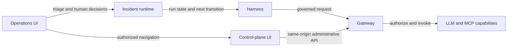

# Current MVP boundaries and Sprint 2 traceability

This is the current scope reference for issues
[#151](https://github.com/creep1ng/sre-agent/issues/151) and
[#50](https://github.com/creep1ng/sre-agent/issues/50). It replaces historical descriptions that
made the gateway coordinate the incident conversation or described signal adaptation as a general
anomaly engine.

## Scope matrix

| Inside the MVP | Outside the MVP | Demo-specific glue |
|---|---|---|
| Governed LLM and MCP capability discovery/invocation | General anomaly-detection engine | Deterministic OpenTelemetry signal-to-canonical-alert adapter |
| Principals, credentials, Resources, grants, and metadata-only audit | Cloud deployment and production multi-tenancy | Reproducible OTel demo failure, verification, and reset operations |
| Authorized Operations and control-plane browser surfaces | Autonomous incident declaration without policy or operator intent | Seeded demo principals, grants, aliases, and disposable credentials |
| Incident workflow runtime, durable runs, replay, and human decisions | General-purpose workflow engine | One bounded incident scenario and recording-provider harness |
| Harness-led incident conversation and governed capability calls | Gateway-owned UI or conversation coordination | Same-origin browser proxy for local/demo integration |

The deterministic signal adapter maps a known source envelope into a canonical alert. It does not
learn baselines, correlate arbitrary signals, score anomalies, or declare incidents. Those are
general anomaly-engine responsibilities and remain outside the MVP.

## Runtime responsibility flow

| Boundary | Owns | Does not own |
|---|---|---|
| Operations UI | Alert selection, incident context, human commands, authorized navigation to administration | Workflow transitions, capability authorization, or harness conversation |
| Incident runtime | Deterministic transitions, decisions, concurrency, replay, and persistence ports | Browser navigation or provider/MCP transport |
| Harness | Incident conversation, step execution, and selection of contracted LLM/MCP operations | Gateway policy decisions or UI coordination |
| Gateway | Authentication, authorization, routing, audit, and capability adapters | Incident conversation, UI state, or a general workflow engine |
| Capabilities | Bounded LLM inference and MCP discovery/invocation behind grants | Authority to bypass gateway policy |

Navigation from Operations to the control plane is part of the MVP, but it is not an authorization
shortcut. The destination must use the authenticated browser–API seam and the control API still
returns 403/404 according to the caller's grants. Issue
[#19](https://github.com/creep1ng/sre-agent/issues/19) owns the administrative user outcome;
[#56](https://github.com/creep1ng/sre-agent/issues/56) defines its user map; and
[#148](https://github.com/creep1ng/sre-agent/issues/148) owns the secure browser–API seam.

## Executable traceability

| Requirement | Executable issue | Epic |
|---|---|---|
| Principal and credential administration | [#147](https://github.com/creep1ng/sre-agent/issues/147), then UI outcome [#19](https://github.com/creep1ng/sre-agent/issues/19) | [#5 EP-4](https://github.com/creep1ng/sre-agent/issues/5) |
| Authenticated browser–API integration | [#148](https://github.com/creep1ng/sre-agent/issues/148) | [#5 EP-4](https://github.com/creep1ng/sre-agent/issues/5) |
| Alert disposition into dismiss/link/declare | [#23](https://github.com/creep1ng/sre-agent/issues/23) | [#6 EP-5](https://github.com/creep1ng/sre-agent/issues/6) |
| Incident command contract and runtime | [#145](https://github.com/creep1ng/sre-agent/issues/145), [#26](https://github.com/creep1ng/sre-agent/issues/26) | [#6 EP-5](https://github.com/creep1ng/sre-agent/issues/6) |
| Authoritative incident/run persistence | [#146](https://github.com/creep1ng/sre-agent/issues/146) | [#6 EP-5](https://github.com/creep1ng/sre-agent/issues/6) |
| Deterministic OTel signal adaptation | [#149](https://github.com/creep1ng/sre-agent/issues/149) | [#6 EP-5](https://github.com/creep1ng/sre-agent/issues/6) |
| Harness-to-runtime/capability integration | [#35](https://github.com/creep1ng/sre-agent/issues/35), [#185](https://github.com/creep1ng/sre-agent/issues/185) | [#7 EP-6](https://github.com/creep1ng/sre-agent/issues/7) |
| Configurable LLM routing | [#24](https://github.com/creep1ng/sre-agent/issues/24) | [#7 EP-6](https://github.com/creep1ng/sre-agent/issues/7) |
| Governed MCP runtime | [#187](https://github.com/creep1ng/sre-agent/issues/187), with user outcomes [#29](https://github.com/creep1ng/sre-agent/issues/29) and [#30](https://github.com/creep1ng/sre-agent/issues/30) | [#4 EP-3](https://github.com/creep1ng/sre-agent/issues/4) |
| Final consolidated documentation | [#50](https://github.com/creep1ng/sre-agent/issues/50), informed by [#151](https://github.com/creep1ng/sre-agent/issues/151) | [#8 EP-7](https://github.com/creep1ng/sre-agent/issues/8) |

## Scope decisions and deviations

| Topic | Current decision | Status |
|---|---|---|
| Gateway versus harness | Gateway governs capabilities; harness coordinates the incident conversation. | Current |
| Signal adaptation versus detection | The OTel adapter is deterministic demo glue; a general anomaly engine is outside the MVP. | Current |
| MCP | MCP discovery and invocation remain inside the MVP through governed Resources and grants. | Current |
| “MSP” references | The owner confirmed on 2026-09-07 that MSP was a transcription error for MCP. Read historical MSP references as MCP; no separate capability or scope is introduced. | Confirmed |
| Operations → control navigation | Included when the destination is authenticated and grant-authorized; no cross-surface authority is implied. | Current |

The owner's confirmation resolves issue #151's terminology decision. Issue closure still requires
publication and verification of the documentation deliverables.

### Historical text that is not current authority

- `docs/hu-ops-01-threshold-contract-pending.md` records a Sprint 1 contract gap. Its statement
  that the control boundary is empty predates the real administrative API and is not current.
- `docs/incident-run-contract-consumers.md` records the contract-only state before the incident
  runtime and persistence work units. Use it for wire compatibility, not implementation status.
- Sprint 1 UI fixture notes describe the original alert-inbox slice; they do not permit fixture
  fallback at the browser–API seam or assign conversation coordination to the gateway.

## Proposed #50 reconciliation

When #50 consolidates final documentation, it should:

1. link this scope matrix as the current boundary reference;
2. retain the runtime flow and explicit gateway/harness ownership;
3. keep the OTel adapter under demo integration, never anomaly detection;
4. cover MCP administration and runtime as MVP capabilities;
5. include the authorized Operations-to-control navigation path; and
6. preserve the confirmed MSP-to-MCP transcription correction without introducing separate scope.
